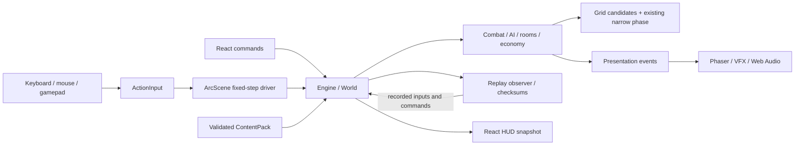
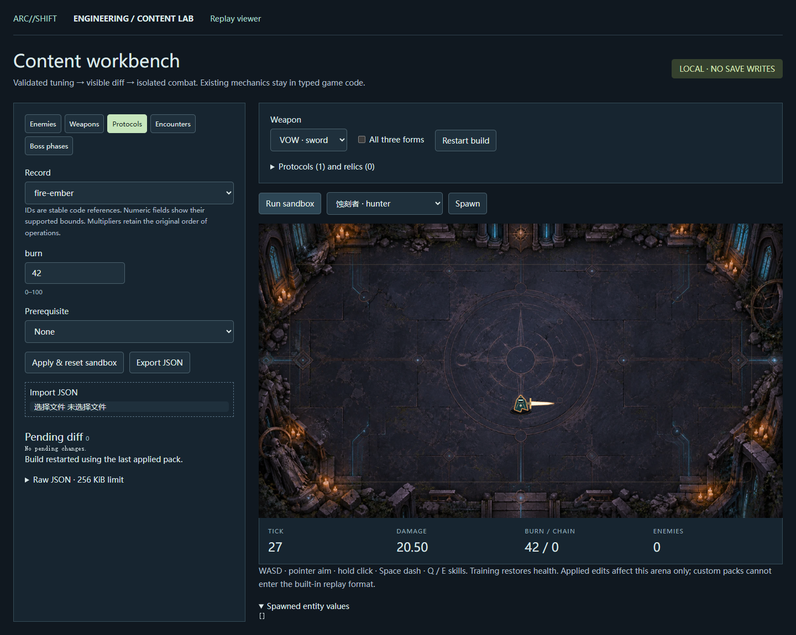

# ARC//SHIFT — Game Client Engineering

**[在线试玩](https://arc-shift.black-kid-3047.chatgpt.site/) · [五项目展示入口](https://arc-shift.black-kid-3047.chatgpt.site/portfolio/) · [A–G 工程交付](docs/delivery-v2.md) · [A–T 面试讲解](docs/interview-dossier.md) · [CI 与原始验收](docs/qa-report.md)**

一个可直接在浏览器玩的原创动作构筑游戏：圣剑、法器弹幕与重炮混搭，沿十二层路线管理资源、协议和遗器。本轮在已有 v1.0 玩法上完成客户端工程升级，保留原玩法与美术，重点处理可复现性、参数工具、输入边界和性能证据。

| 工程能力 | 实现与可核对的结果 |
|---|---|
| **Spatial Hash / Uniform Grid** | 保留 brute-force oracle；250 敌人固定夹具中分离/弹体几何测试减少 **92.53% / 97.68%**，Engine P95 **1.8786 → 1.0712 ms**。[原始数据与反例](docs/performance-v2.md) |
| **Deterministic QA Replay** | 固定步输入、奖励/路线/消费等有序命令与执行结果、版本校验、周期 checksum、导出/单步/失同步停播。[设计](docs/replay.md) |
| **Gameplay Editor + Debugger** | 封闭参数 schema、语义 diff、JSON 往返、独立真实 Engine 沙盒；单步、调速、池/网格/FSM 叠加。[内容流程](docs/content-pipeline.md) |
| **Automated QA** | 本地完整里程碑检查、Linux CI、生产隔离、存档/回放回归、六种子共 **648,000 模拟 tick**。[结果与失败记录](docs/qa-report.md) |
| **Input actions** | 键鼠与标准 Gamepad API、可配置键位、边沿锁存、死区、焦点与断连保护；实体手柄兼容性未测。[输入边界](docs/input.md) |



核心规则不依赖 Phaser，可由 Node 直接运行；集中式 World 加系统函数不是严格 ECS。**本项目是 QA replay，不是网络 lockstep。** 性能表只衡量该固定模拟夹具；浏览器帧率没有一致提升，不宣称所有设备稳定 60 FPS。[完整架构](docs/architecture.md) · [工程案例：问题到结果](docs/engineering-case-study.md)。


## 运行与快速演示

Node.js 22.13+，推荐 24；锁文件安装：

```sh
npm ci
npm run dev
```

打开 `http://127.0.0.1:5173`。发布构建为 `npm run build`，本地生产预览为 `npm start`。产物为静态 `dist/`，无需数据库、账号或 API Key。`.openai/hosting.json` 绑定本项目的 Sites 站点，复制项目时使用自己的部署配置；仓库没有部署凭据。

**三分钟演示**：在线进入“营地与图鉴 → 协议试炼”，开启三重共鸣，观察剑弧、炮击和元素载荷组合；回到正式行动展示资源和完整路线；随后打开本地内容工作台或回放页，解释同一套规则如何被检查。试炼和 DEV 沙盒不覆盖正式行动存档。

| 本机开发入口 | 可以操作什么 |
|---|---|
| `/dev/replay` | 录制、下载/导入、单步、×2/×4、checksum 与失败区间 |
| `/dev/content-editor` | 编辑已有参数、校验/diff、导入导出、武器/卡牌/遗器沙盒 |
| `/dev/debugger` | 暂停、单步、调速、生成敌人/Boss、协议、命中框/网格/FSM |

这些开发入口不出现在生产构建。公开页面提供游戏和真实工程截图，开发工具需要本机启动。[操作说明](docs/content-editor.md) · [调试器说明](docs/debugger.md)。



默认键鼠：WASD/方向键移动、鼠标瞄准、左键攻击、Space 跃迁、Q 脉冲、E 引力、B 炸弹、R 灵药、Escape 暂停。系统设置可改键。标准手柄左/右摇杆移动/瞄准，RT 射击、A 跃迁、LB/RB 技能、X/Y 消耗品、Start 暂停；菜单和路线仍使用键鼠。移动端可浏览，没有触屏战斗操控。音乐在第一次点击后启动。

玩法包括 40 项协议、三种混搭武装、三种场景、四种 Boss、十二层二十八节点路线、十种遭遇、金币/钥匙/炸弹/灵药/碎片及局外解锁。规则、剧情与素材历史详见 [v1.0 说明](docs/v1-release.md)、[设计小册](docs/game-design.md) 和 [竞品研究与原创边界](docs/competitive-analysis.md)。

## 验证与复现

```sh
npm run typecheck
npm run lint
npm test
npm run test:e2e
npm run build
npx playwright test --config playwright.production.config.ts
npm run bundle:report
npm audit
```

Windows 浏览器测试默认使用已安装的 Edge；Linux/macOS 先安装 `npx playwright install chromium`，可通过 `PLAYWRIGHT_CHANNEL` 指定已有浏览器。每个工程里程碑都运行完整开发浏览器套件。push/PR CI 运行游戏、回放、输入 smoke 和独立生产检查；手动 `full_suite` 或每周默认分支任务运行全部浏览器场景及长模拟。运行日志、环境、源码 SHA、trace 和产物随 CI 上传。[工作流](.github/workflows/ci.yml)。

当前测试数量、最近完整通过记录及失败历史集中在 [验收报告](docs/qa-report.md)，不把测试发现数当成通过数。受控 Gamepad API 快照不是实体手柄；DEV 后期场景不是自然真人通关；合计三小时的 headless 模拟不是墙钟三小时的浏览器压力测试。

```sh
node scripts/benchmark.cjs current-grid
npm run test:soak -- --long
```

暴力算法对照、CPU profile 与浏览器采样的完整命令见 [performance-v2.md](docs/performance-v2.md)。静态目录包含按需加载的作品集录屏和手册；bundle 总字节数包含这些媒体，不能等同于游戏首次网络传输量。

## 文档与工程判断

- [工程案例](docs/engineering-case-study.md)：Problem → Evidence → Alternatives → Design → Implementation → Verification → Result → Remaining limitations。
- [内容管线](docs/content-pipeline.md)、[回放](docs/replay.md)、[稳定性](docs/stability.md)、[依赖安全记录](docs/dependency-security.md)。
- [17 个指定技术追问](docs/interview-v2.md) 与 [完整 A–T 手册](docs/interview-dossier.md)：真实结果、失败、10 个核心文件、5 个 UI 文件、10 段代码、20 个追问、5 条简历候选。
- [提交介绍与演示路径](docs/portfolio.md)、[AI 开发记录](docs/ai-development-log.md)、[素材来源与许可](assets/LICENSES.md)。

**AI-assisted disclosure**：用户提出方向、范围与作品要求；Codex 参与大量实现、测试、审查与文档工作。自动测试不等于独立玩家研究。提交者应如实说明自己的实际参与，亲自读懂关键路径并复现报告，不将生成代码描述为无辅助独立手写。

仍未验证：实体控制器、手柄菜单全流程、跨 JS 引擎确定性、多设备稳定帧率、墙钟级浏览器泄漏与真人平衡。自定义参数包回放被显式拒绝；没有联网、云存档、任意脚本模组或可信排行榜。源码 [MIT](LICENSE)，第三方库和字体保留各自许可。
