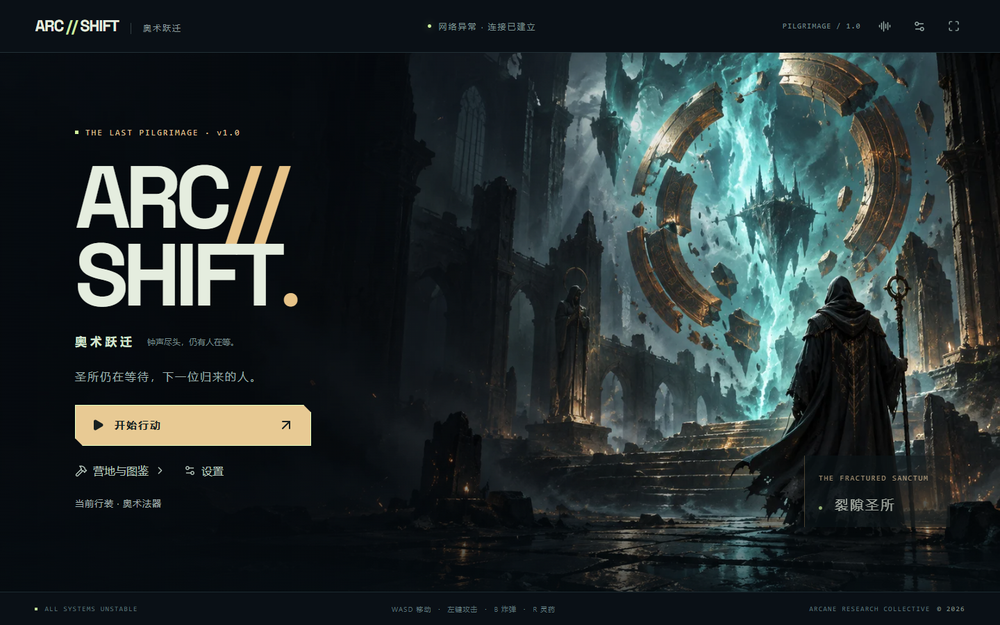
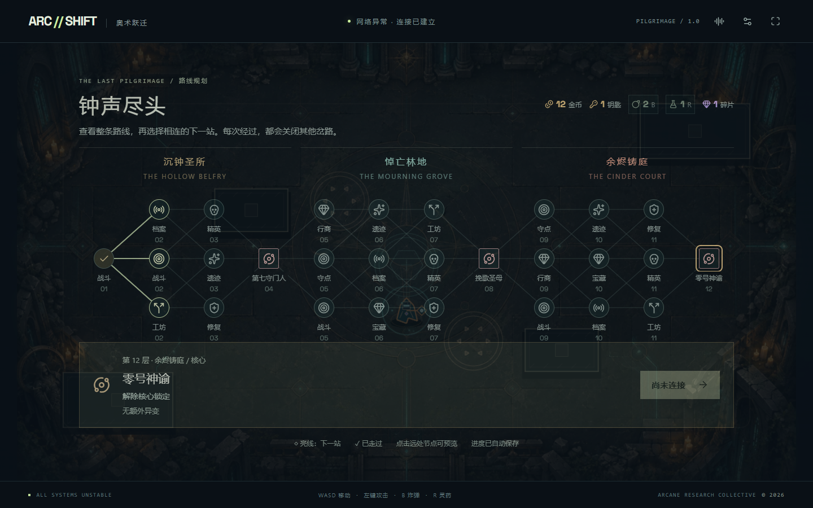
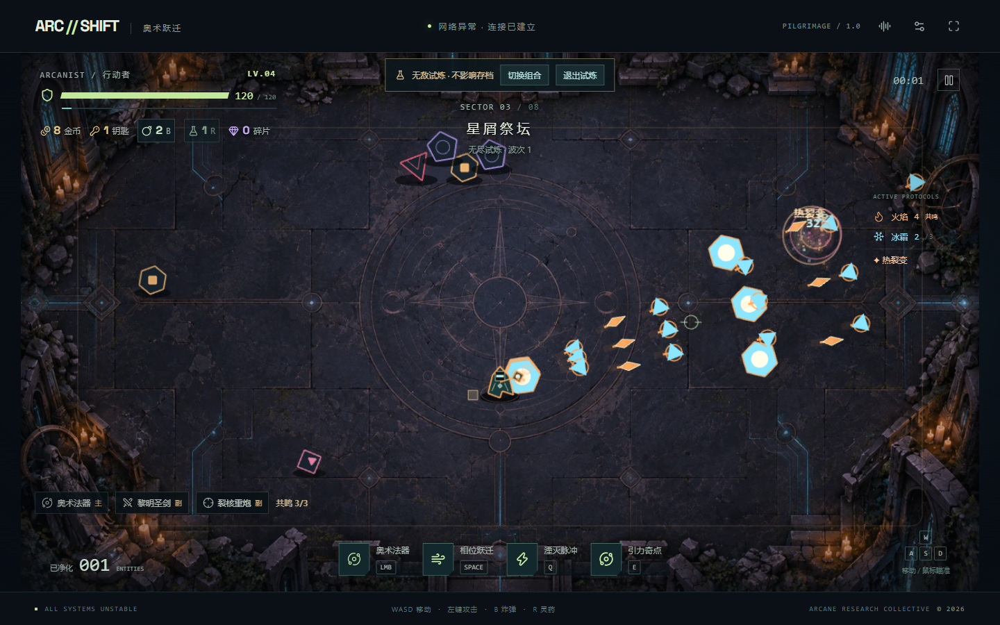
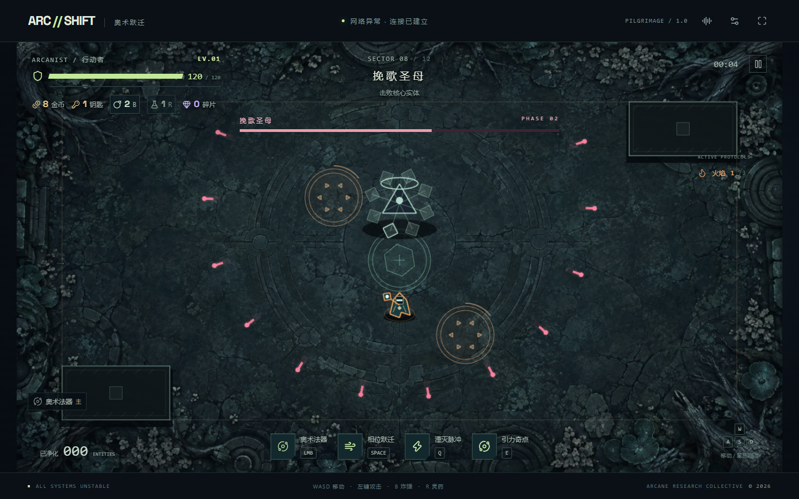
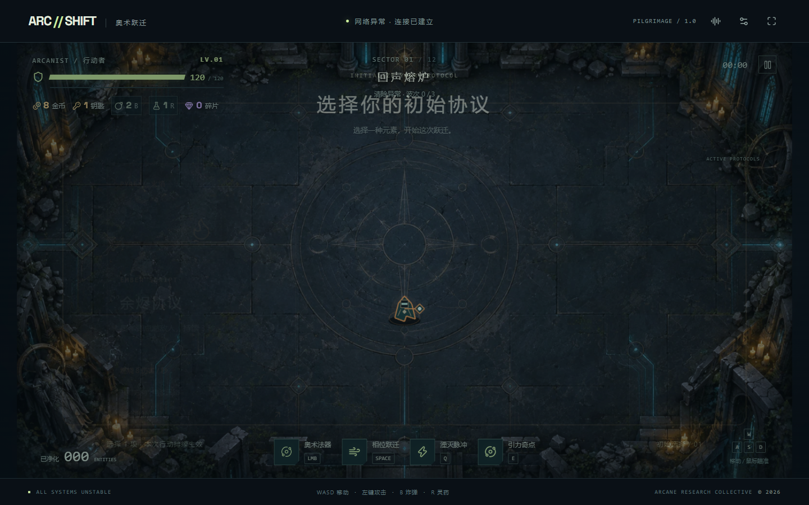

# ARC//SHIFT · 奥术跃迁 — v1.0「钟声尽头」

魔法文明与失控 AI 网络融合后的原创俯视角动作 Roguelite。圣剑、弹幕与重炮可在一局中混搭，沿十二层分支路线穿越三个地区，选择遭遇、管理资源并面对三个核心；四种 Boss 可在不同行动中遇见。

[在线试玩](https://arc-shift.black-kid-3047.chatgpt.site) · [作品提交与演示](docs/portfolio.md) · [v1.0 更新](docs/v1-release.md) · [架构](docs/architecture.md) · [面试指南](docs/interview-guide.md)



快速看组合效果：**营地与图鉴 → 协议试炼 → 开启三重共鸣 → 选择组合**。无需注册，试炼不覆盖正式行动。正式行动第二层可选择工坊，免费熔接第二种武装。

## 玩什么

- 连续移动与射击、无敌 Dash、清弹脉冲 Q、引力场 E。
- 三种免费武装：高频奥术法器、三连斩与斩弹的黎明圣剑、缓慢范围爆破的裂核重炮。
- 金币、钥匙、炸弹、灵药与随身碎片；清场营地包含行商、协议箱、血誓祭坛与碎片归档。
- 金币重抽与补给取舍，失败带回半数随身碎片；局外行装提升新行动的生命与初始补给。
- 八种普通敌人、精英变体、四种各三阶段的 Boss；攻击预警、侧翼瞬移、护盾支援与恢复窗口。
- 40 项升级、火焰 / 雷电 / 冰霜 / 虚空 / 跃迁五系；形态 × 弹道 × 命中效果可叠加，同系三张触发共鸣。
- 陨星、光矛、分裂、波动、环绕、回旋、浮游使魔与 Dash 弹雨；六种跨系反应，奖励提示可补齐的组合。
- 六套「协议试炼」直接体验完整组合，无敌无限波，不改变原行动的存档与统计。
- 十二层二十八节点全图预览，十种遭遇类型，驻守符阵、工坊熔接、遗迹抉择、档案阅读与死亡/胜利结算。
- 六件碎片与 Boss 条件解锁的遗器；十二篇记忆残片和独立图鉴；主界面通过营地二级菜单管理行装。
- 原创生成的圣所、林地与铸庭地面，以及裂隙主视觉；实体障碍、封闭角落、周期陷阱和中央增益区。
- 三个地区、四个 Boss 的原创主题，阶段变奏与神谕终阶段的稀疏尾声；五系射击音色、独立音乐/音效音量。
- 入口 / 奖励 / 地图检查点、协议发现记录、设置保存；无需账号或后端。

| 操作 | 输入 |
| --- | --- |
| 移动 / 瞄准 | WASD 或方向键 / 鼠标 |
| 武器攻击 | 按住鼠标左键；圣剑为近战三连斩 |
| 投放炸弹 / 喝灵药 | B / R（满血不耗药） |
| 相位跃迁 | Space，沿移动方向；静止时沿准星 |
| 近身脉冲 / 引力奇点 | Q / E |
| 暂停 / 继续 | Escape；失焦也会暂停 |

桌面键鼠体验为主要目标。移动端可浏览菜单和档案，没有触屏战斗操控。行动时长随路线、选卡与熟练度变化；可通过试炼快速展示组合。关闭页面后从最近检查点继续，房内战斗不会逐帧保存。v0.3 未完成的八区域行动仍可继续；新行动采用十二层路线。

## 本地运行

Node.js 22.13+，推荐 24；npm。

```sh
npm ci
npm run dev
```

打开 `http://127.0.0.1:5173`。发布构建与本地预览：

```sh
npm run build
npm start
```

静态产物为 `dist/`，可由普通静态服务器托管。当前 Sites 部署配置在 `.openai/hosting.json`；这是此项目的远端绑定，复制项目时应使用自己的部署配置。仓库不包含凭据。

## 验证

```sh
npm run typecheck
npm run lint
npm test
npm run test:e2e
```

Playwright 会启动或复用开发服务器。Windows 默认使用已安装的 Microsoft Edge；其他平台先运行 `npx playwright install chromium`。可设置 `PLAYWRIGHT_CHANNEL` 选择已安装的浏览器。截图和原始浏览器报告输出到忽略目录 `outputs/qa/`。

v1.0 验收覆盖合法路线、事件单次结算、混搭武装、资源交易、存档兼容、实际键鼠输入与完整规则模拟；实际数量和结果见 [验收记录](docs/qa-report.md)。自动控制器精确读取世界状态，不代表真人胜率。Boss 后期、胜负等浏览器验收使用明确的开发测试场景。`?qa` 测试入口只在开发构建启用，生产包移除。

完整规则模拟可复现为 `npm run test:simulation -- storm-arc sword`，末尾武器可换为 `arc` 或 `cannon`，初始协议可换为 `fire-ember` 与 `ice-touch`。每次运行 3 个种子 × 2 类路线，输出到 `outputs/qa/`；控制器与规则执行的计时分开，报告见性能文档。

| 技术 | 责任 |
| --- | --- |
| TypeScript / 固定 60 Hz 模拟 | 世界状态、伤害、AI、卡牌、随机数与存档 |
| Phaser 3 | 输入、Canvas / WebGL、场景、缩放、几何绘制 |
| React 19 / Base UI / shadcn | 菜单、HUD、卡牌、路线与设置 |
| Web Audio | 原创乐谱、分层合成、独立总线、声部限制 |
| Vite / Vitest / Playwright | 构建、规则回归与真实浏览器验证 |

核心代码从 `src/game/engine.ts` 阅读；战斗系统不依赖 Phaser，可单独测试。界面约 12.5 Hz 更新；弹体、粒子、飘字与次生反应有容量上限；三个场景复用地面纹理，图片加载失败时回退到圣所或程序地面。





## 作品集材料



- [Game Design Mini Spec](docs/game-design.md)：循环、操作、敌人、Build、范围。
- [v0.2 版本说明](docs/v02-release.md)：新增协议、跨系反应、试炼与音乐。
- [v0.3 版本说明](docs/v03-release.md)：局内经济、局外准备、三种武装、研究来源与存档规则。
- [竞品研究与原创边界](docs/competitive-analysis.md)：以撒、杀戮尖塔、死亡细胞等作品的官方来源与设计推导。
- [系统架构](docs/architecture.md)：主循环、伤害、事件、场景生命周期、状态与存档。
- [性能记录](docs/performance.md)：优化前后实际采样、复杂度和未达目标。
- [验收记录](docs/qa-report.md)：测试范围、三轮打磨、已知局限。
- [面试指南](docs/interview-guide.md)：22 个问题和三种时长的项目介绍。
- [AI 开发记录](docs/ai-development-log.md)：自动实现、独立审查、实际修复和人的责任。
- [素材来源与许可](assets/LICENSES.md)：生成图片、代码几何 / 原创乐谱、字体与第三方库。

## 当前边界

这是完整可玩的作品集版本，尚未经过商业发行级验证。场景包含不同障碍布局、封闭角落、陷阱与增益区；没有迷宫生成、全局寻路、联网、手柄或云存档。角色与敌人仍为代码几何绘制，尚无逐帧精灵动画集。性能数据见 [本版压力采样](docs/performance.md)，未承诺所有硬件稳定 60 FPS，也未做长期内存压力测试。真人难度、手感与组合平衡仍需更多玩家反馈。

源码采用 [MIT](LICENSE)。大量代码与文档由 AI 辅助产生，具体分工见开发记录；字体和第三方库保留各自许可证。
