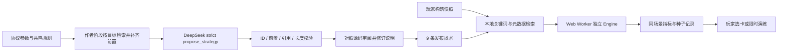

# ARC-SHIFT v1.2：战术教练与攻击变形

2026-09-11。该版本把有来源的模型战术、可复现的游戏推演和可亲手验证的演练接起来，同时按本轮反馈调整击退、击停、随机开局与流派融合。这里记录已实现的功能与实际局限；不把自动化测试称为真人游玩研究。

## 先演示，再解释

1. 主菜单 → **战术教练**。选择单体、敌群或走位目标，输入“连锁”“跃迁”等关键词，点击“比较候选”。右侧是检索到的说明，左侧按实际指标重新排序。
2. 展开规则依据与测量方法，导出 JSON。营地可将候选带入 **30 秒无敌演练**；正式奖励界面则只比较眼前的三张卡，每个候选只增加一张。
3. “营地与图鉴 → 协议试炼”体验 **钉穿重弹** 与 **回锋冰刃**。第一次跃迁演练也已改为单一主武器的协议组合。


## 产品参考及实际取舍

| 参考产品 | 参考的设计 | 本项目已实现 |
| --- | --- | --- |
| NVIDIA G-Assist，2025-03-25 发布说明 | 将请求约束在受支持的操作中，并返回可观察指标 | 封闭卡牌词表、真实引擎比较、记录导出；没有任意代码执行 |
| Xbox Gaming Copilot，2025-09-18 历史 Beta 案例 | 按需出现，结合游戏上下文帮助玩家 | 暂停读取当前武器、协议、形态、遗器和奖励；关闭后恢复原行动 |
| OP.GG AI Voice，2026-05-29 更新的帮助页 | 根据当前局面给出构筑与行动建议 | 当前三选一比较，解释代价，允许亲手验证 |

以上是设计借鉴，不是合作或背书。Xbox 一项仅引用历史设计，不据此声称其当前可用范围；OP.GG 也不是 Riot 官方教练。来源：[NVIDIA](https://www.nvidia.com/en-us/geforce/news/g-assist-ai-companion-for-rtx-ai-pcs/)、[Xbox](https://news.xbox.com/en-us/2025/09/18/gaming-copilot-xbox-pc-mobile/)、[OP.GG 官方帮助](https://help.op.gg/hc/en-us/articles/58426534694041-What-features-does-OP-GG-AI-Voice-offer)。

以撒的近年官方更新继续增加“同一攻击载体继承道具行为”的组合，例如让 Parasitoid 效果由 Technology/Brimstone 承载，以及 Abyss 效果随吸收道具变化。我们据此推导自己的攻击变形，不复制素材或数值。[2024-11-18 官方更新](https://steamcommunity.com/games/250900/announcements/detail/7119722540407193808)、[2025-02-11 官方更新](https://steamcommunity.com/games/250900/announcements/detail/511824140485787668)。

## AI 链路，哪些部分真正用了模型



- **模型在作者阶段调用**：本次实际返回模型名为 `deepseek-flash`，根据 `/models` 实测选择，不从过时网页别名推断。向 `/beta/chat/completions` 提交 `strict:true` 的 `propose_strategy` 工具，使用枚举、必填字段和 `additionalProperties:false`，关闭思考模式并指定工具。
- **检索增强**：给模型的是按武器/目标筛出的规则、参数和前置闭包。运行时是稀疏关键词与精确元数据加权，没有向量模型、embedding 数据库或学习排序。
- **工具结果需要继续验收**：JSON/枚举约束之外，程序检查卡数、去重、递归前置、引用是否属于卡组或成立共鸣、武器适用性、说明长度。`validateStrategy` 不验证自然语言真假。
- **源码对照修订**：热裂变作用对象、第三斩的形态条件、追踪不保证命中等说明经编码助手对照实现修订。没有声称真人专家验收；原响应和修订清单分别保留。
- **运行时本地推演**：试玩不会向 DeepSeek 发送玩家输入、存档或关键词。Worker 中新建 `Engine({save:blankSave(),persistence:false})`，使用当前参数、等级、形态及遗器。没有在线 LLM 自动执行游戏工具、多轮代理或强化学习训练。
- **动作边界**：关闭/改目标会终止 Worker；20 秒超时；返回及应用结果前检查完整快照。选卡再次由现有 `Engine.chooseCard` 校验；整套范例只能从营地进入独立演练。自定义参数停用旧战术说明，但实际奖励仍可用自定义规则推演。

DeepSeek 官方文档说明 strict 模式与支持的 schema 边界；合法 JSON 不等于正确业务含义。[Tool Calls](https://api-docs.deepseek.com/guides/tool_calls/)、[Chat Completion](https://api-docs.deepseek.com/api/create-chat-completion/)。这些是近年产品中常见的技术组合，不声称每项技术都在这两年首次发明。

## 真实失败与用量

| 实验 | 生成请求 | 通过本地结构验收 | 输入 / 输出 tokens |
| --- | ---: | ---: | ---: |
| 默认思考模式 | 2 | 0 | 1,872 / 3,200 |
| 普通 JSON 模式 | 2 | 0 | 1,822 / 317 |
| strict 工具调用 | 11 | 9 | 17,429 / 3,714 |
| 合计 | 15 | 9 | 21,123 / 7,231 |

共 **28,354 tokens**，不含三次 GET `/models`，费用未核对账单。三批请求方式不同，不能把合计接受率当作同分布 A/B 实验。strict 批 9 个目标首轮通过 7 个，首轮 **7/9**；两个目标重试一次后均通过，不能称一次生成 100% 正确。

第一批两次均耗尽 1,600 reasoning tokens，输出截断。第二批两次把共鸣 `plasma` 当成可选卡牌。strict 的两次拒绝实际是 explanation **186、188 字**超过应用上限 140，并非前置或引用失败，也不是 strict schema 失效。结构接受之后仍发现机制说明错误，说明语义审阅不可被结构成功率替代。

原始记录：[thinking-limit](qa/coach-v12/generation-thinking-limit.json)、[JSON rejected](qa/coach-v12/generation-json-rejected.json)、[strict receipts](qa/coach-v12/generation.json)、[说明修订](qa/coach-v12/semantic-revisions.json)。记录中不含密钥。生成脚本的新运行只写 `outputs/coach/` 提案，不能直接覆盖已审阅的线上战术库。

## 推演数字的含义

每套构筑使用三个固定种子，在单靶与八靶两种场景各运行 720 tick，即 12 秒。最近靶距离 80 像素，固定位置、高生命、无地形；持续攻击，Q/E 就绪即释放，不使用 Dash。记录实际结算伤害、元素反应、施放次数和弹体池申请失败次数。

输出排序用三种子平均 DPS；走位排序是跃迁冷却 → 移速 → 单体 DPS。范例有 4–6 张协议，与当前构筑不一定等预算；真实奖励比较才是“当前构筑＋一张卡”。不跨武器比较最优，不给胜率或通关保证。

固定靶复位会抵消聚拢与击退位移；场景不衡量击杀/斩杀收益、吸血、承伤、Dash 触发收益和首领走位。短期三个种子没有置信区间，不能外推真人水平或真实关卡收益。

一个有价值的反例：默认 Lv.4 法器、无形态修饰和遗器时，模型标为“单体”的范例在此靶场并非最高输出；排名由独立引擎决定，不照抄模型标题。完整样本与机器时间见 [evaluation.json](qa/coach-v12/evaluation.json)，这是本机一次离线测量，不是线上延迟承诺。

导出结果携带 `gameVersion=1.2-protocol.1`、`coach-range-2`、内容快照、输入场景、种子及逐样本结果。重算不兼容版本会明确拒绝。

```sh
npm run coach:evaluate
npm run coach:evaluate -- path/to/arc-shift-coach-evidence.json
# 可选：终端非回显输入自己的密钥，生成待审阅提案
npm run coach:generate
```

## 战斗手感与融合规则

| 改动 | 实际行为与限制 |
| --- | --- |
| 近战接触 | 基础击退外，近距离普通斩额外推开 26px，终结斩 42px；远一些分别为 18/30px。经过墙体检测，精英减半，首领免疫。 |
| 局部顿挫 | 普通斩/终结斩剑弧短停约 33/50ms；受击普通敌人短暂硬直且有 0.2s 重触发间隔。玩家移动和其他敌人继续更新。 |
| 弹体阻力 | 可继续穿透的主弹短停；陨星＋光矛为 50ms。保留命中集合，不在停留中重复扣血。停留点有亮环；近战有短促低音与轻微震动，减少动态效果可抑制震动。 |
| 随机开局 | 独立种子流选择三种初始武器；营地偏好只影响演练。相同种子可复现，继续行动保留存档里的武器。 |
| 形态改写 | 取消副武装按独立冷却自动攻击。法器可变穿透刃或小爆破弹；重炮可变穿甲刃或命中碎弹；圣剑获得第三斩剑气或首处命中冲击。UI 显示具体改造与代价。 |
| 回锋冰刃 | 圣剑＋回旋＋冰霜：第三斩撤掉近战扇面，改为一枚穿透回收刃；不扫除原扇面敌弹，回程不重复命中同一敌人。 |

旧存档格式不变，具体武器/协议/资源保留并按新规则运行。战斗语义改变，因此旧回放明确不兼容；旧原始夹具保留，新版历史单独存于 `tests/fixtures/replays/v12/`，不是改版本头伪造兼容。

## 本轮验证

178 项单元检查通过，生产构建的 6 项浏览器检查通过，TypeScript 与 lint 通过。开发浏览器完整稳定源码回归为 42/43：原有远程输入测试假设开局必为法器，在随机圣剑开局时无法命中远靶；修正测试夹具后，该用例与回锋冰刃操作用例均补测通过，共覆盖 43 个不同场景。保留首轮失败结果，不记成单次 43/43。

教练浏览器导出已通过 CLI 逐项重算一致；另保留 1280/1440 宽界面、限时完成与实际弹刃截图。性能仅为本机每种负载一次采样，未声称本轮普遍提升帧率。[检查摘要与源码/构建哈希](qa/coach-v12/checks.json) · [实际回锋冰刃画面](qa/coach-v12/return-blade-demo.png)。

## 三分钟讲解稿

“我做的是一个能解释、能复现、能亲手验证的战术教练。参考 G-Assist 的受限操作和游戏教练的上下文帮助，我让它读取真实构筑，只处理当前三张奖励或已核对的范例。

“作者阶段，DeepSeek 接收检索出的规则，用 strict 工具参数输出战术。程序检查 ID、前置、引用和长度。真实日志里，普通 JSON 曾把共鸣当卡牌；strict 后仍有说明过长的问题。即使结构通过，追踪必命中、热裂变伤害对象等叙述还需要对照源码修订。

“运行时不用实时模型控制战斗。浏览器 Worker 新建独立引擎，以固定种子、相同场景实际结算伤害，然后再排序。模型认为偏单体的方案，也可能被测试排到后面。玩家可以导出全部输入和结果，重算逐项验证。

“数字有边界：12 秒固定靶场没有承伤、地形、击杀和真实走位，结果不是胜率。完整范例与当前卡数可能不同；只有奖励三选一才是同预算比较。最后进入限时演练，由玩家判断手感。

“玩法上，我把融合改为同一个攻击载体继承行为：重弹命中后停顿再贯穿；圣剑第三斩可变为回收冰刃，但失去近战覆盖。AI 生成、引擎验算和玩家决策各自有清楚的职责。”

进一步可以实测真人首次选卡耗时、建议采纳后是否改变理解、两种组合的操作辨识度。当前没有这些真人数据，不预填提升百分比。
