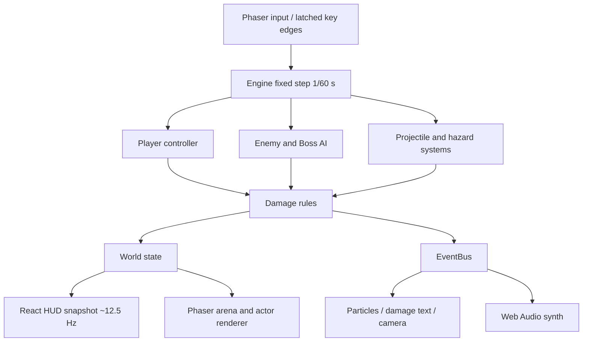
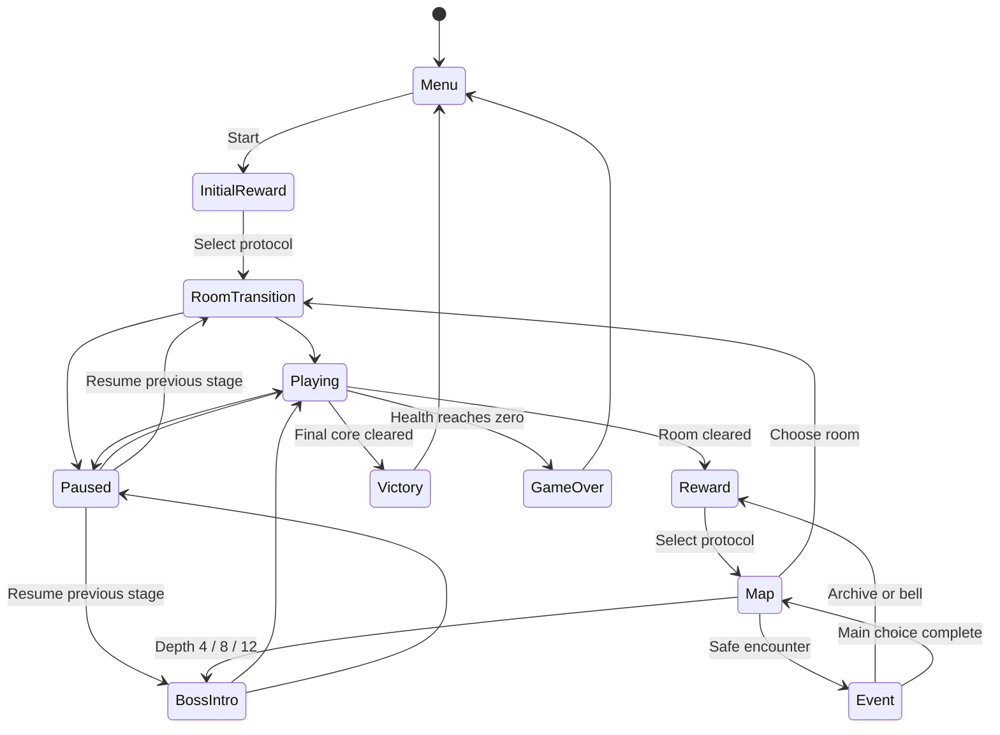
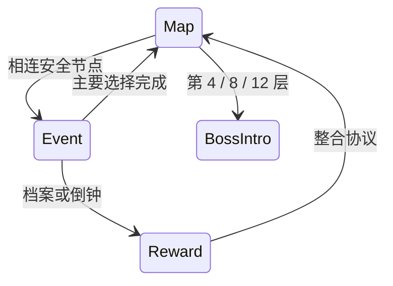

# Architecture

## 总体结构

Phaser 3 负责输入、缩放和程序化渲染；React 负责菜单、HUD、奖励、路线、档案和设置。核心规则为无 Phaser 依赖的 TypeScript，可在 Node 中直接测试。它采用集中 World 数据与分离系统函数，不是严格 ECS。

| 目录 | 实际责任 |
| --- | --- |
| `src/game` | World、Engine、Phaser 场景；DEV 测试接口单独模块 |
| `src/core` | RNG、数学、事件总线、对象池、存档校验 |
| `src/systems` | 玩家操作与技能、范围危险区 |
| `src/combat` | 伤害、暴击、护盾、无敌、扫掠碰撞、共享激光几何 |
| `src/ai` | 敌人计时状态机、Boss 阶段和招式 |
| `src/cards` | 卡牌数据、前置要求、属性推导、奖励选择、共享反应目录与试炼配置 |
| `src/data` | 敌人基础数值 |
| `src/rooms` | 种子路线图、房间、波次、障碍与场地机制 |
| `src/progression` | 遗器、Boss 解锁、记忆与图鉴目录 |
| `src/render` / `src/effects` | 几何场景、角色、预警、粒子、飘字 |
| `src/audio` | 四小节乐谱、音频时钟调度、独立总线、五系音色与声部限流 |
| `src/ui` | React 界面与可选 WebMCP |

## 主循环与输入

Phaser 每帧采集连续移动/射击状态。Space、Q、E 的 key-down 事件先锁存，再在下一次固定步消费一次，解决“渲染帧没有模拟步”与“极短按下释放在同一帧”两类漏键。单渲染帧增量最多 50 ms，避免后台切回产生大量追帧；严重卡顿时模拟时间会落后于现实时间。

更新顺序为玩家与主副攻击 → 挥砍和炸弹 → 地形 → AI → 弹体 → 危险区 → 拾取。各阶段检查死亡，死亡后不能继续吸血、升级或胜利。暂停、选卡、路线、遭遇和结算状态不推进战斗。失焦自动暂停，包括房间过渡与 Boss 介绍；继续时恢复原阶段。设置弹窗额外阻止场景输入与时间推进，Escape 关闭弹窗后仍维持暂停。

## 战斗与表现边界

伤害层更新生命、护盾、状态和击杀统计，通过事件通知粒子和声音。特效不决定命中。高速子弹使用前后位置组成的线段与目标圆检测，穿透弹用已命中 ID 集合避免重复命中。反弹时修正越界坐标。

连锁电弧、范围爆炸和持续伤害使用 `proc=false`，避免再次触发完整命中链造成指数递归。短时间 burn/slow 状态直接存储在敌人数据中，尚未抽象为通用 Buff 容器。

v0.2 将形态、弹道、命中载荷分别保存在派生属性和弹体数据里。分裂、使魔、残响产生 generation=1 次生弹，可继承轨迹及燃烧/寒冷，但不再次触发分裂、暴击和完整命中链。每模拟步最多 12 次反应，并使用目标冷却；嵌套范围伤害只有一次死亡结算。回旋在出射 0.45 秒或寿命的 42%（取较短值）后开始，边界无可用反弹时提前返航；保留命中集合并在靠近玩家时回收。环绕弹撞墙反弹后脱离轨道，防止贴墙重复扣反弹次数。

音频以 AudioContext.currentTime 为时钟，以 profiles.ts 定义三个地区和四个 Boss 的四小节主题，速度、和弦、旋律和打击乐各异，阶段变奏在小节边界应用。master/music/sfx 独立总线使用短音量斜坡，配共享压缩器和延迟；总声部最多 30、音乐最多 12。暂停立即关闭音乐总线并停止调度；销毁清理节点和上下文，重建后重新初始化限流时间。

Phaser Scene 同时监听 shutdown 与 destroy，释放 EventBus 和窗口事件；React 清理阶段也主动释放。保留 React StrictMode，用浏览器测试检查最终只有音效与场景两个表现订阅者。这个边界修复了第一次受击访问已销毁文字纹理的问题。

## 数据驱动与扩展

敌人 HP、速度、伤害、颜色与半径来自 `ENEMIES`。卡牌名称、说明、稀有度、元素和前置要求来自目录；基础属性统一由 `deriveStats(cards, level, relics)` 推导，升级和续玩使用相同路径。新增数值型协议很简单，新增特殊机制仍需在相关系统编写行为，不能把当前系统称作完全无需代码的技能编辑器。

五系各三张时激活共鸣。奖励有独立派生 RNG，战斗暴击或粒子不会改变奖励。提供初始种子不等于已经实现输入录像、跨平台锁步或完整确定性回放。

## 状态与存档

存档包含设置、已发现协议、累计统计，以及入口/奖励/地图/遭遇四种检查点。进入房间时保存 HP、护盾、Build、等级和统计；战斗途中恢复会重建该房入口，不保存敌人、弹体、冷却和房内随机状态。清场和选卡完成后也保存，避免刷新后重复奖励或丢卡。结算有幂等锁。

localStorage 解析检查版本、卡牌 ID、房间类型和关键数值；不可用时保留本次会话并在设置里提示。没有后端、云同步或账号要求。

v0.2 沿用 arcshift.save.v1 格式与旧卡牌 ID，无需迁移原检查点。Engine.practice 使用独立 World，checkpoint 与 finish 在试炼时不写存档；start/resume 清除试炼标记，退出后可继续原行动。试炼没有最终结算和有限波数上限。

## v0.3 资源与武装

`economy/catalog.ts` 提供钱包、上限、价格、准备等级与武装定义；`loot.ts` 负责有界掉落、靠近吸附和清场收取。掉落缓冲最多 96，满载直接发放，避免表现容量吞掉资源。死亡结算仍幂等，Boss 增援标记为 summoned，排除有效击杀、经验、掉落与吸血。

Engine 的 buy / openChest / bloodPact / bankShards / reroll 校验阶段、位置、余额、容量和单次使用记录，再统一保存。归档不分开写余额与检查点，避免刷新重复领取。准备与武器在新行动开始时复制进 World，并进入 Checkpoint；旧格式安全补默认值，局外升级不追溯生效。

`combat/weapons.ts` 将攻击按武装分派。圣剑扇形使用圆与有限扇形的精确相交，包含径向边界端点而不是独立扩大角度和半径；每次挥砍记录命中 ID。炮弹通过池字段 shape / blastRadius 表示，shoot() 每次重置；次生溅射关闭完整命中链。B / R 使用按下沿锁存，与固定步模拟、暂停生命周期一致。`render/arsenal.ts` 绘制实际剑弧、持握武器、物资和炸弹预警；音效通过同一事件总线播放。

存储失败时交易仍可在会话内使用，营地显示不可持久化提示。战斗中退出按入口整体回滚，包括消耗品；检查点机制不是实时战斗快照。

## v1.0 路线、混搭与遭遇

`expedition(seed)` 生成十二层二十八节点；`availableNodes` 与 `Engine.travel` 校验相邻边。战斗和精英进入模拟，安全节点进入 `event`，选择后转入奖励或地图。地图可查看未来节点，但不能提前穿越。第 4、8、12 层为核心汇合。

`World.forms` 保留主武装并容纳另外两种副武装。`fireSupports` 使用独立冷却，不改写主武装射击间隔；剑弧、扇形剑气、范围爆破和炮弹碎片由真实攻击触发。次生代标记与反应预算限制递归。`relics` 进入派生属性和特定机制，装备、解锁、记忆归入局外目录。

`resolveEvent` 校验阶段、房型、余额和完成标记。主要遭遇选择单次结算；开箱、商店库存与归档独立记录。检查点保存 campaign、route、forms、relics 和 eventDone；恢复时从种子重建规范节点，校验路径顺序和事件阶段。入场护盾在恢复入口时不重复授予。旧存档保持 legacy 八区域规则，新行动使用 pilgrimage。

## 平台与工程取舍

源码包含 Sites 初始化的组件目录；游戏运行从 `index.html → src/main.tsx → app/page.tsx` 进入，部署为 Vite 静态 `dist/`，不启动 RSC 或 Worker 服务。只有界面需要 React，核心规则不依赖它。

v1.0 场景复用圣所、林地与铸庭地面，图片失败回退圣所或最多四张程序地面缓存。障碍阻挡移动、Dash、弹体与剑弧；移动按至多 8 px 子步滑动，弹体和剑弧使用分段遮挡检测。敌人有碰撞滑动和局部侧移，没有通用障碍寻路。动态角色与预警继续用 Graphics。扩大敌群前应先测量空间查询和 Graphics 提交成本，实测范围见性能记录。

Lint 配置移除了静态 Vite 项目不适用的 Next.js 页面规则；Phaser 的 UMD 默认导出由 TypeScript 与实际构建验证。未启用 React Compiler，故不套用其不可变外部模型规则，Engine 是明确的可变模拟对象。保留 Hooks 与其他正确性规则；未修改的 scaffold 组件 / hooks 作为供应组件不纳入 lint 计数。
