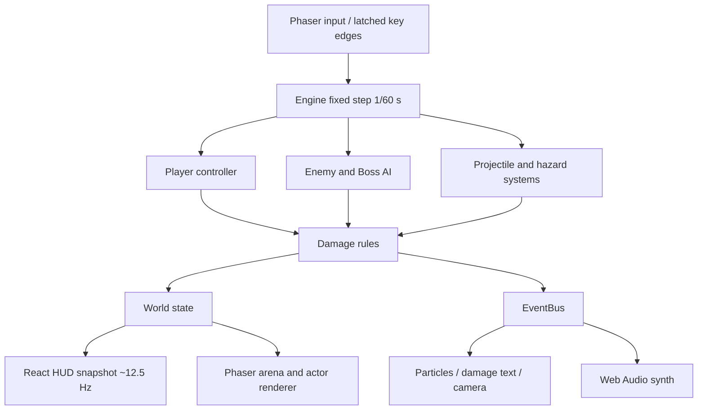
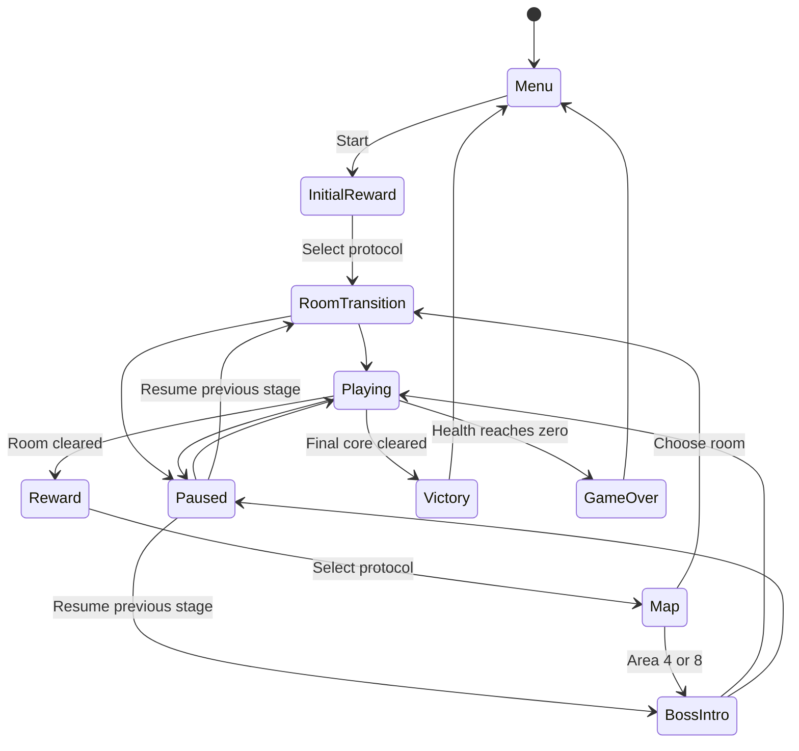

# Architecture

## 总体结构

Phaser 3 负责输入、缩放和程序化渲染；React 负责菜单、HUD、奖励、路线、档案和设置。核心规则为无 Phaser 依赖的 TypeScript，可在 Node 中直接测试。它采用集中 World 数据与分离系统函数，不是严格 ECS。

| 目录 | 实际责任 |
| --- | --- |
| `src/game` | World、Engine、Phaser 场景；DEV 测试接口单独模块 |
| `src/core` | RNG、数学、事件总线、对象池、存档校验 |
| `src/systems` | 玩家操作与技能、范围危险区 |
| `src/combat` | 伤害、暴击、护盾、无敌、扫掠碰撞、共享激光几何 |
| `src/ai` | 敌人计时状态机、Boss 阶段和招式 |
| `src/cards` | 卡牌数据、前置要求、属性推导、奖励选择 |
| `src/data` | 敌人基础数值 |
| `src/rooms` | 房间与路径生成、波次规则 |
| `src/render` / `src/effects` | 几何场景、角色、预警、粒子、飘字 |
| `src/audio` | 振荡器、音量、声部限流、环境音型 |
| `src/ui` | React 界面与可选 WebMCP |

## 主循环与输入

Phaser 每帧采集连续移动/射击状态。Space、Q、E 的 key-down 事件先锁存，再在下一次固定步消费一次，解决“渲染帧没有模拟步”与“极短按下释放在同一帧”两类漏键。单渲染帧增量最多 50 ms，避免后台切回产生大量追帧；严重卡顿时模拟时间会落后于现实时间。

更新顺序为玩家 → AI → 弹体 → 危险区。各阶段检查死亡，死亡后不能继续吸血、升级或胜利。暂停、选卡、路线和结算状态不推进战斗。失焦自动暂停，包括房间过渡与 Boss 介绍；继续时恢复原阶段。设置弹窗额外阻止场景输入与时间推进，Escape 关闭弹窗后仍维持暂停。

## 战斗与表现边界

伤害层更新生命、护盾、状态和击杀统计，通过事件通知粒子和声音。特效不决定命中。高速子弹使用前后位置组成的线段与目标圆检测，穿透弹用已命中 ID 集合避免重复命中。反弹时修正越界坐标。

连锁电弧、范围爆炸和持续伤害使用 `proc=false`，避免再次触发完整命中链造成指数递归。短时间 burn/slow 状态直接存储在敌人数据中，尚未抽象为通用 Buff 容器。

Phaser Scene 同时监听 shutdown 与 destroy，释放 EventBus 和窗口事件；React 清理阶段也主动释放。保留 React StrictMode，用浏览器测试检查最终只有音效与场景两个表现订阅者。这个边界修复了第一次受击访问已销毁文字纹理的问题。

## 数据驱动与扩展

敌人 HP、速度、伤害、颜色与半径来自 `ENEMIES`。卡牌名称、说明、稀有度、元素和前置要求来自目录；基础属性统一由 `deriveStats(cards, level)` 推导，升级和续玩使用相同路径。新增数值型协议很简单，新增特殊机制仍需在相关系统编写行为，不能把当前系统称作完全无需代码的技能编辑器。

五系各三张时激活共鸣。奖励有独立派生 RNG，战斗暴击或粒子不会改变奖励。提供初始种子不等于已经实现输入录像、跨平台锁步或完整确定性回放。

## 状态与存档

存档包含设置、已发现协议、累计统计，以及入口/奖励/地图三种检查点。进入房间时保存 HP、护盾、Build、等级和统计；战斗途中恢复会重建该房入口，不保存敌人、弹体、冷却和房内随机状态。清场和选卡完成后也保存，避免刷新后重复奖励或丢卡。结算有幂等锁。

localStorage 解析检查版本、卡牌 ID、房间类型和关键数值；不可用时保留本次会话并在设置里提示。没有后端、云同步或账号要求。

## 平台与工程取舍

源码包含 Sites 初始化的组件目录；游戏运行从 `index.html → src/main.tsx → app/page.tsx` 进入，部署为 Vite 静态 `dist/`，不启动 RSC 或 Worker 服务。只有界面需要 React，核心规则不依赖它。

目前同一竞技场边界配四种地面装饰模板，无障碍寻路。地面使用每模板一次的纹理缓存，最多四张；动态角色与预警继续用 Graphics。扩大敌群前应先测量空间查询和 Graphics 提交成本，当前压力样本尚未达到 60 FPS。

Lint 配置移除了静态 Vite 项目不适用的 Next.js 页面规则；Phaser 的 UMD 默认导出由 TypeScript 与实际构建验证。未启用 React Compiler，故不套用其不可变外部模型规则，Engine 是明确的可变模拟对象。保留 Hooks 与其他正确性规则；未修改的 scaffold 组件 / hooks 作为供应组件不纳入 lint 计数。
