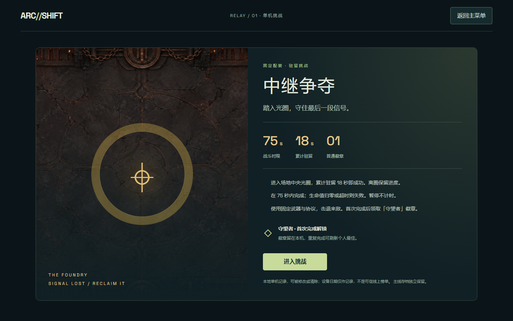
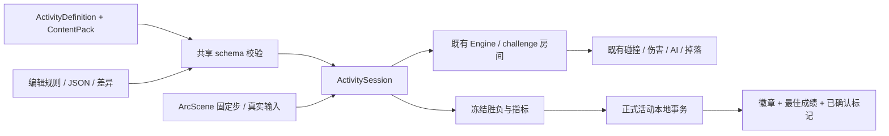
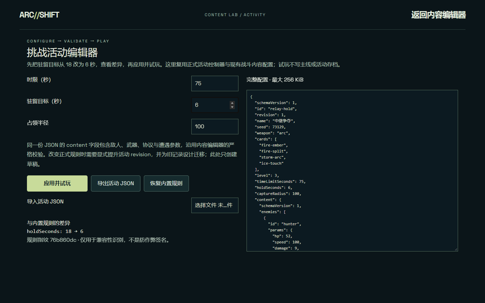

# ARC-SHIFT：客户端展示版本

本轮从 `0567590`（2026-09-11 v1.2）继续，保留现有引擎。2026-09-17 实施，分为性能/体验与配置活动两个阶段。本文会将实测、自动化流程与真人反馈分别标明。

## 已有能力核对

| 能力 | 当前实现与复用方式 |
| --- | --- |
| 空间网格 | `UniformGrid` 覆盖跨格圆 AABB、扫掠弹体、来源数组顺序及击退更新；保留 brute-force oracle，本轮不改碰撞路径。 |
| 回放 | 固定步输入/命令/校验和、版本检查；继续使用已提交的 v1.2 历史夹具，不重录掩盖偏差。 |
| 内容编辑器 | 封闭 ContentPack schema、范围/引用/前置校验、JSON 导入导出、差异及独立引擎沙盒；活动继续使用同一 ContentPack。 |
| 存档 | 主线格式 1、旧字段归一化、房间检查点；主线不承诺恢复任意战斗中间帧。 |
| 浏览器优化 | 静态地形纹理缓存、角色/敌弹图片池、特效池、HUD 显示值签名已完成，直接复用。 |

## 第一阶段：实际体验与性能

先实际启动浏览器，用现有流程检查完成开始、键鼠战斗、奖励三选一、暂停/失焦、死亡及重开，5 项检查通过。需要快速到达死亡/首领状态的步骤使用明确的 QA 夹具；这不是普通玩家自然通关或真人反馈。

### 定位与实现

旧的 `presentationMs` 只记录绘图命令准备，遗漏后续 Graphics 曲线细分与批提交。新增测量包装后，250 敌单次 profile 的 Graphics render CPU P95 为 38.3ms，而 Engine 单步 P95 为 2.1ms。CPU 与采样分配都指向 Phaser 动态 ARC/路径细分和 Earcut；几像素的装饰光晕也经过约 100 点的圆弧路径。

只修改表现层：

- 动态小型实心光晕、友弹中心和敌人阴影使用缓存单位圆的三角扇，直接提交 `fillTriangle`，省去重复 Point/路径/Earcut；按 **0.35 个游戏逻辑像素**的弦高误差选择 8/12/16/24/32 边。大尺寸自定义几何和 Canvas 保留旧曲线，避免透明三角形独立抗锯齿产生接缝。
- 飘字复用原 40 个 Text；只有颜色或字号发生变化才更新样式，减少重复 canvas 纹理上传。没有减少敌人、弹体、粒子容量或模拟推进。
- 攻击预警、敌弹、碰撞半径和规则代码保持原路径。DEV 诊断开关保留旧装饰绘制与文字样式路径，便于同一程序内交错对照；生产忽略该开关。

### 多轮原始对照

同一 Windows 设备、Headless Edge、1440×900、DPR 1、完整特效、静音、种子 73129、相同固定步输入。每次新页面先运行 120 步预热，再运行 **600 个测量步**；每场景 3 对样本，旧/新顺序轮换，共 18 份。下表为三次分位数/比例的中位数，不是合并帧后重新计算的分位数。

| 场景 | 帧间隔 P95 旧 → 新 | >33.3ms 帧占比旧 → 新 |
| --- | --- | --- |
| 28 敌 | 25.4 → 15.2ms | 2.76% → 0% |
| 100 敌，含障碍与动态陷阱 | 37.3 → 20.2ms | 10.38% → 0% |
| 250 敌 | 48.5 → 31.7ms | 33.82% → 3.26% |

250 敌 P95 中位数下降 **34.64%**。所有接受样本最终均 720 世界步（包含预热）及 12 秒模拟时间；权威世界 checksum、伤害、随机状态、事件哈希、钱包和查询计数完全一致。另从优化前提交提取源码，与当前源码分别运行三种武器、40 个可击杀敌人、1,200 固定步，并对照 grid/brute：每 120 步校验和、伤害、击杀、拾取与掉落事件逐项相同。

补充分位数（同样取三轮的中位数）：

| 场景 | P50 旧 → 新 | P99 旧 → 新 | >50ms 帧占比旧 → 新 |
| --- | --- | --- | --- |
| 28 敌 | 13.4 → 6.8ms | 36.9 → 18.9ms | 0% → 0% |
| 100 敌含地形 | 19.6 → 8.9ms | 39.4 → 25.9ms | 0% → 0% |
| 250 敌 | 30.3 → 16.8ms | 52.8 → 37.7ms | 2.76% → 0% |

保留一个被排除的初次 after 样本：先启动世界再异步加载地形模块，导致提前 3 步、总时间 12.05 秒。最终脚本在重置世界之前解析全部模块，并断言实际世界步为 720；最终 18 份数据不使用该样本。

### 测量边界

- 这是同机 DEV 游戏的轻量插桩结果，无 CDP 的主对比仍包含计时包装和事件哈希；不是生产版 FPS、全设备保证或统计显著性结论。CPU/heap/GC profile 单独采集。
- 帧间隔是 Phaser `postrender` 到下一次 `postrender`。`renderSubmitMs` 记录 `WebGLRenderer.render`，包含内部 `graphicsRenderMs`，两者不可相加；外层 pre/postRender 提交不在该子计时中。GPU 执行没有单独测量。
- `Engine.update` 包含同步特效事件；`hudAndAudioMs` 只包含帧末显示签名/音频回调，未包含随后 React reconciliation。CPU profile 另保留 React 的调用栈。
- 固定步与权威战斗事件相同；VFX 按显示帧衰减，更多显示帧会改变装饰粒子的可见数量及随机调用，不能声称逐像素负载相同。
- 单次 profile 的 GC 外层事件总耗时 **532 → 875ms**，没有改善；不能将路径分配热点减少写成“消除了 GC”或把采样字节数当作存活内存。profile 包含自身开销，CPU/分配样本还含准备与预热。

[完整比较与边界](qa/client-showcase/phase1/comparison.json)、[原始配对记录](qa/client-showcase/phase1/paired-final/results.json)、[可击杀行为对照](qa/client-showcase/phase1/behavior-after.json)、[49 项针对性单元结果](qa/client-showcase/phase1/phase1-unit.json)。同目录保存初始基线、排除记录、截图及 gzip 压缩的 Chrome trace、CPU 和分配 profile；解压后可用 Chrome DevTools/Perfetto 查看。

```sh
# 开发服务启动后，使用固定工作量交错对照
node scripts/client-performance.mjs paired-final --paired
node scripts/client-performance.mjs profile-new --trace
node scripts/client-performance.mjs profile-old --trace --legacy
node scripts/profile-summary.mjs outputs/client-showcase/profile-new
```

## 第二阶段：配置挑战活动

### 玩家流程

主菜单 → **中继争夺 / 挑战活动** → 规则页 → 进入挑战 → 中央光圈累计驻留 18 秒 → 成功或失败 → 结算确认 → 返回活动大厅或主菜单。时限 75 个模拟秒，配装与种子固定。离圈保留进度，暂停不计时。生命归零、超时和主动撤离分别显示原因；成功后首次领取「守望者」徽章，重复完成只更新个人最佳，不重复发奖。

公开路径 `/challenge`，开发编辑器 `/dev/activity-editor`。正式活动按真实伤害运行，不使用训练场补血。保留已有按键绑定、音效、地形、视觉反馈与碰撞系统。撤离确认期间锁住游戏输入与暂停切换，避免遮罩下恢复战斗；设备音频初始化失败时仍可开始游戏。



### 配置与执行

`ActivityDefinition` 封闭 schema 包含活动 ID/revision、种子、武器、协议、等级、时限、驻留目标、占领半径，以及**原有 ContentPack**。数值范围同时驱动编辑器表单与运行时校验。JSON 导入限制 256 KiB；拒绝未知字段、错误类型、超范围值、缺失前置协议、非法内容引用和目标不小于时限等配置。

`ActivitySession` 持有禁止持久化的独立 `Engine`，注入规则后进入原有 challenge 房间；仅增加活动计时和终态判定，不复制战斗、AI、掉落或碰撞代码。ArcScene 的产品控制器按 1/60 秒调用它，入场/暂停不增加活动计时。死亡优先；最后允许步达到驻留目标，判成功；终态后不推进结果。草稿和正式活动使用同一控制器。



### 持久化与失败处理

| 情况 | 处理 |
| --- | --- |
| 主线旧存档 | 主线格式仍为 1，活动使用独立 `arcshift.activities.v1`，不改主线检查点、货币或装备。 |
| 刷新战斗页 | 取得页面独占锁后，active 转为 interrupted；不恢复战斗中间帧、不捏造统计、不发奖。 |
| 刷新已保存未领取结果 | 展示同一结算，先处理结果再允许下一次挑战。 |
| 重复保存/领取 | 相同结果幂等；同 ID 不同结果报冲突；徽章、最佳成绩和 acknowledged 一次 setItem 提交。 |
| 写入失败 | UI 不提交成功状态；保留结果重试，未保存结算不能领取。关闭未保存页面有离开提示。 |
| 多个标签页 | 正式活动页生命周期持有 Web Lock；第二页不能开始或误判第一页面中断。关闭第一页后可重新连接恢复。 |
| 损坏、未来版本或规则不匹配 | 保留原始数据并阻止覆盖，提供不计成绩试玩；没有跨 revision 自动迁移，升级规则时须另行设计。 |
| 开发者草稿 | 不获取正式活动存储、不发正式徽章；内容/规则可改，战斗仍有真实胜负。 |
| 不支持 Web Locks | 正式记录不可用，提供不计成绩模式。公开 HTTPS 和本机 localhost 可正常持锁。 |

这是本机离线活动。日期只是设备生成的记录标签；倒计时使用模拟步而不是设备日期。徽章/最佳成绩可被修改或清除，规则指纹只是兼容性识别，**不是签名、防作弊或可信线上运营系统**。低帧率可能使墙钟完成时间变长，本机成绩也不是跨设备竞技排行。

活动暂不进入普通 QA replay 格式：录制器显式拒绝活动会话。普通 v1.2 历史回放继续核对原夹具，没有重新生成参考值。

### 三分钟现场演示

1. **0:00–0:35，问题与证据**：打开原始比较，指出旧计时遗漏 Graphics 提交；展示 250 敌 P95 和卡顿占比，说明同样的 720 世界步及行为校验。
2. **0:35–1:25，玩家活动**：主菜单进入中继争夺，介绍配装、光圈和 75 秒时限；实际移动、攻击、暂停，撤离并确认结果。可另行完整挑战，不承诺现场自动通关。
3. **1:25–2:15，改一项规则**：开发服务下从内容编辑器进入活动编辑器，把驻留目标 **18 → 6**，看差异，应用并试玩。进入光圈驻留 6 个模拟秒验证；遭敌人击败仍然失败。
4. **2:15–2:45，错误与存档**：返回编辑器将目标改为 75，展示校验与禁用按钮；打开两页正式活动展示独占保护。草稿不污染正式徽章或主线存档。
5. **2:45–3:00，工程边界**：解释本地时间、无可信排行、活动不支持普通回放；保存失败可重试，真人体验反馈待收集。



运行：`npm ci` → `npm run dev` → `http://127.0.0.1:5173/`；生产构建 `npm run build` → `npm start`。生产保留游戏与活动，开发编辑器不随公开构建暴露。`127.0.0.1` 只在运行服务的设备打开，不能直接发给朋友当公网地址。

### 验证材料

活动 30 项单元契约、6 项浏览器检查覆盖配置、胜负边界、计时、受伤、退出、刷新、重复提交、跨标签页、写入重试、音频降级与草稿不写存档。成功/死亡/超时的部分浏览器步骤明确使用 DEV 边界夹具；编辑器 6 秒挑战用键盘移动完成，仍属于脚本验证。

全量单元 **211 项通过**，包含网格暴力对照与历史回放。最终源码再次执行原始提交的三武器击杀/伤害/掉落 oracle，逐项相同。原始 [单元报告](qa/client-showcase/phase2/unit.json)、[活动浏览器报告](qa/client-showcase/phase2/activity-browser.json)、[最终行为记录](qa/client-showcase/phase2/behavior-final.json)，及同目录最终开发/生产检查记录。

完整开发浏览器 **49 项通过**；最后的活动语义/清理修正后单独复跑 **6 项通过**；最终生产构建 **8 项通过**，确认产品控制器实际推进驻留、开发入口隔离和异常存档降级。typecheck、lint 与 build 通过。[带源码哈希的验收清单](qa/client-showcase/phase2/checks.json)。本轮没有远端 Linux CI 或多设备性能结论。

过程中发现并修复：weapon/reason 数组被 String 转换误接收、不可能的零秒成绩、同 ID 不同结果误作重试、撤离遮罩下 Esc 恢复、音频失败遗留 active、提示不反映重绑。首次单元失败另有两个夹具假设错误：fire-split 本身无前置，以及 idle 猎手不会马上接触攻击；改用 fire-fuel 和 chase 状态。没有放松产品断言掩盖失败。

## 简历：问题—实现—结果

按本人实际参与程度选择措辞；本项目有 AI 辅助实现、测试与审查，不能描述成无辅助独立手写。

**性能方向**：针对高密度弹幕卡顿，通过浏览器 CPU、分配与分阶段帧计时定位 Phaser 动态圆弧细分和文本纹理重复上传；实现误差受限的缓存三角扇及文字样式去重。同机、同种子、同输入、同画质三轮交错对照，250 敌场景帧间隔 P95 中位数 **48.5 → 31.7ms（下降 34.64%）**，>33.3ms 帧占比 **33.82% → 3.26%**；固定工作量和三武器伤害/击杀/掉落对照保持一致。

**业务玩法方向**：针对活动开发易复制战斗代码、规则修改难验证的问题，在 ContentPack 与 Engine 上实现可配置守点挑战，贯通说明、战斗、胜负、徽章结算和退出；共享 schema 支持表单/JSON 校验与隔离试玩，页面独占锁和单次存储提交处理重复结算、刷新恢复及写入失败。实现驻留规则 **18 → 6 秒**的直接修改与完整试玩，不覆盖主线旧存档。

可追问：为何不继续优化网格？实测热点在绘制；为何不只比较 FPS？固定模拟工作量和行为必须相同；为何不声称 GC 改善？总 GC 时间反而上升；为何不做在线活动？本轮目标是客户端完整流程，本机记录不具备可信运营语义。

## 真人反馈：等待用户参与

材料只有工程验证，没有邀请真人的记录。请用户和朋友实际试玩后填写 [玩家反馈表](client-player-feedback.md)，再决定难度、击退、顿挫和提示是否需要调整；不能用脚本胜率代替玩家满意度。
