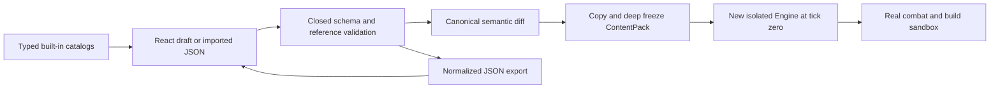

# Content pipeline: validated parameters to a real arena

The local workbench at `/dev/content-editor` edits existing game parameters. It is available after `npm ci` and `npm run dev`; it is intentionally absent from the public game. [Workbench instructions](content-editor.md).

## Ownership and review

The editor keeps draft, validated and applied state separate. Editing text does not mutate a running game. Invalid input remains visible with an error, while apply/export stay unavailable. Applying replaces the sandbox Engine atomically and resets simulation time, which prevents half of an encounter from running with old values and half with new values. It does not read or write the player's save.

The parameter schema lives in [src/content/schema.ts](../src/content/schema.ts). Imports are limited to 256 KiB UTF-8, known fields and IDs, finite bounded values, complete unique catalogs, valid references, acyclic prerequisites and ordered Boss thresholds. Accepted records are canonicalized and frozen. There is no script, image, URL or arbitrary executable import facility.

## Actual consumers

| Existing content | Configurable parameters | Mechanics that remain code-defined |
|---|---|---|
| 12 enemy records | HP, speed, damage, radius | FSM, perception and attack patterns |
| 3 weapons | Damage, interval, projectile speed, sword arc/range, cannon blast | Combos, support weapons, triggering and obstruction rules |
| 40 protocols | Supported numeric operations and reward prerequisites | New status types, proc chains, synergies, flags and text descriptions |
| Standard encounter record | Spawn pool/count, elite bonus, wave intervals/counts | Late-room/biome additions, legacy counts and infinite practice behavior |
| 4 Boss records | Phase thresholds and recovery | Telegraphs, phase attack sequences and special abilities |

`World.spawn`, `deriveStats`, attacks, wave generation and Boss transitions consume the same pack. Engine start/resume/practice preserve the injected content dependency; ordinary gameplay uses the immutable default. Sandbox selections intentionally bypass unlock requirements for inspection, while normal reward generation still validates prerequisites.

## Change procedure

1. Start with the default pack, select a stable record and adjust a supported field.
2. Read the diff and validation output; inspect coupled bounds such as phase ordering.
3. Apply to a fresh sandbox, select weapon/cards/relics, and observe real spawned values and combat.
4. Export the normalized pack for review. Check numeric outputs as well as descriptions, which are not rewritten automatically.
5. To change shipped defaults, update the reviewed source catalog, its compatibility identifier and meaningful regression expectations. Run the milestone checks before shipping.

Default extraction was checked with 500 deterministic builds against pre-extraction commit `434ea9a`, aggregate SHA256 `812ecf8db5844c8c49d18c086187b236e904a6f72481a4e6884bfaeb88d4f651`. Nine unit tests also verify invalid data and live consumers; two browser flows verify editing, validation, diff, export/reimport and real sandbox execution. These establish parameter correctness, not that a new balance is enjoyable.

Current replays identify the built-in content version and reject custom packs. They do not silently accept a file and simulate it with different tuning. Supporting custom-pack replays requires an explicit format and compatibility design; new mechanics still require code, catalog/schema work and tests.
