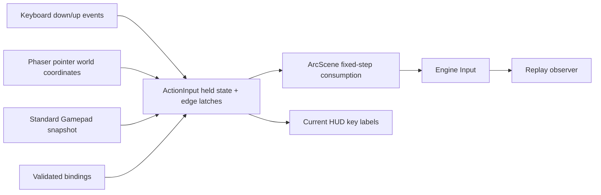

# Input actions and device boundary

Keyboard/mouse and the browser's standard-mapped Gamepad API feed one `ActionInput`. The simulation still receives the same `Input` values: Move, Aim, PrimaryAttack, Dash, Pulse, Gravity, Bomb, Potion and Pause are device-independent intents. Core combat has no dependency on browser devices or Phaser. Replays record the resolved simulation input, so they do not require the recorder's physical bindings or controller.

`src/input/bindings.ts` defines a closed version-1 schema, unique key/button assignments and a 10–50% radial deadzone. The settings panel edits primary movement/skill/pause keys and deadzone, reports conflicts, restores defaults and persists separately to `arcshift.bindings.v1`. Existing gameplay saves and checkpoints retain their version and content. Mouse button, primary-attack keyboard alternatives and standard gamepad button indices are supported by the schema/API; this first UI does not expose every possible binding field. Corrupt/inaccessible browser storage falls back to defaults; runtime configuration remains usable if saving fails.

Default combat controls: left stick moves, right stick aims, RT/R2 fires, A/× dashes, LB/L1 pulses, RB/R1 casts gravity, X/□ drops a bomb, Y/△ drinks a tonic, and Start pauses. Menu navigation, route and reward selection still use mouse/keyboard. The first connected `mapping: standard` controller is selected. Unknown mappings and blocked/unavailable APIs fall back to keyboard/mouse. Device values are clamped and non-finite axes ignored. Browser availability can require an initial physical button press; the API contract and standard mapping are described by the [W3C Gamepad specification](https://www.w3.org/TR/gamepad/).

The deadzone removes drift. Existing movement normalizes every nonzero direction to the game's fixed movement speed; this implementation does not claim proportional analog walking. Keyboard movement takes precedence when pressed. Mouse movement selects pointer aiming; an active right stick selects directional aiming otherwise. Releasing the right stick retains its last direction relative to the moving player. Shooting is held state; skills and pause are rising edges. A controller disconnect clears its pending edges without discarding a keyboard press queued in the same frame.

Keyboard events latch even if down and up both occur before a 144 Hz render. Frames without a simulation tick retain the latch, and catch-up steps consume it only once. OS key repeat is ignored. Opening a dialog clears pending actions and held keyboard movement while continuing to observe controller button levels; closing it cannot turn a held skill button into a new press. Editable fields and browser shortcuts are excluded. Blur clears pending input and fixed-step debt. Space/arrows remain reserved against page scrolling or activating a formerly focused HUD button during gameplay, even when rebound: a real browser regression caught an unmapped Space clicking the just-closed Continue button and pausing again.

Both Phaser canvases explicitly disable `fps.smoothStep`. ArcScene already accumulates a fixed 1/60 step and caps a displayed frame at 50 ms. The additional Phaser smoother capped the first 120 rendered frames, and unfocused frames, to its 16.67 ms target on a low-FPS software renderer. Removing this duplicate smoothing preserves the existing core timestep while making display-time handling explicit. Extremely slow rendering still falls behind wall time because of the deliberate 50 ms cap. This change does not imply cross-device rendering performance or real-time lockstep guarantees.

Ten unit tests cover edge retention, hold behavior, validated immutable configuration copies, radial deadzones/finite values, aim retention, all standard action buttons, disconnect/reconnect, a focus polling gap with a simultaneous keyboard edge, dialog suppression, unavailable storage and identical core checksums for equivalent legacy keyboard inputs. Two browser tests exercise settings conflicts/persistence/restoration and actual engine movement, shooting, skills, resources, pause and disconnect driven through a controlled `navigator.getGamepads` fixture. The latter validates the browser integration, **not a physical controller**; USB/Bluetooth compatibility, controller-only menus and remapping raw/nonstandard devices remain unverified/out of scope.

Focus is a persistent scene state, not just a one-time pause event. While unfocused, physical button levels are observed but pending edges are suppressed, pause cannot resume the run, and the normal simulation cannot advance. Returning focus leaves the run paused; a held Start is not a fresh press. The explicit DEV external simulation driver may continue playback with neutral physical input. Disconnect also immediately returns aiming and HUD hints to mouse/keyboard while retaining an independently queued keyboard edge. The gamepad browser regression includes blur, a new Start press, frozen elapsed time, focus, and release/repress to resume.

On return from a focus/polling gap, the first valid pad snapshot establishes button levels without creating new pad edges; the marker survives empty snapshots. Keyboard edges arriving after focus remain intact. Reconnecting a previously observed controller or switching its index also establishes a baseline, so a held Start/Bomb cannot pause twice or spend another resource. Release/repress is required for a new discrete action; continuous fire remains held state.

The first remote CI also exposed incomplete synthetic focus events and fixed wall-time waits. Test fixtures now pair blur with focus and wait for real simulation progress. A later full local run caught a movement assertion aimed into an actual obstacle and a reward fixture mutated before scene initialization. The corrected checks retrace a known open path and wait for the enabled game-start control before injecting the layout fixture. Failed reports/screenshots are retained in `qa/engineering/m7-input-final` and `qa/engineering/ci-first-failure`; local and Linux browser timings must not be conflated.

Final local M7 acceptance (2026-09-10): typecheck, lint, **146/146 unit tests, 34/34 development browser tests and build** passed in [m7-input-verified/checks.json](qa/engineering/m7-input-verified/checks.json). An additional built-production browser check passed 1/1; audit reported zero known vulnerabilities. The stage records the parent source commit plus then-current working changes; remote CI binds a later committed revision explicitly. [Production browser report](qa/engineering/m7-input-verified/production-browser.json), [audit](qa/engineering/audit-m7.json), [actual input settings](qa/engineering/input-settings.png).
