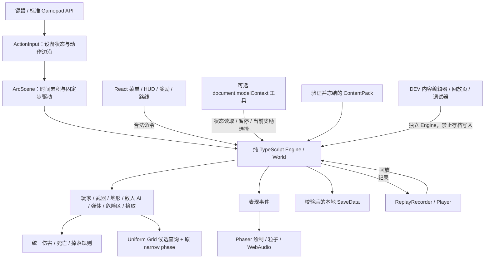

# ARC//SHIFT · A–T 中文面试讲解

> **工程交付讲解 · 2026-09-10。** M7 实现已提交为 `cd4ca2cc8cf59a0ff9f045b97635e1d5dd34fc46`。完整本地验收为 **146 单元 / 34 开发浏览器 / 另行 1 生产浏览器**通过，typecheck、lint、build 通过，依赖审计 0。原始阶段日志记录提交前工作区及其父提交；不能把父提交误认为完整受测代码。最终公开版的 CI 与交付状态统一见 [验收记录](qa-report.md)。
>
> 本文保留 A–T 二十节。ARC 是浏览器单机游戏，对不存在的数据库、RAG、LLM Agent、LLMOps 和相关评测明确写 N/A。本人采用第一人称项目介绍前，须实际读码与复现；AI-assisted 分工不省略。

## A. 最终系统架构

ARC//SHIFT 是以魔法与失控网络为主题的动作构筑游戏：三种武器形态、协议反应、房间路线、局内资源与局外成长形成循环。本轮工程升级在已有玩法上增加碰撞优化、可复现回放、内容工作台、开发调试器、稳定性验证与输入适配，重心是让已有行为可解释、可复现、可维护。



职责边界是核心：World 保存可变运行态；Engine 控制阶段与调用顺序；战斗规则决定命中和结算；Phaser 负责输入采样、固定步调度与表现；React 通过 Engine 命令推进非实时选择，HUD 约每 80ms 刷新。核心系统不导入 Phaser，Node 可以直接运行同一套战斗逻辑。这里是集中式 World 加系统函数，并非严格 ECS，也没有服务端权威模拟。[架构说明](architecture.md)、[Engine](../src/game/engine.ts)、[Scene](../src/game/scene.ts)、[UI 生命周期](../src/ui/GameApp.tsx)。

**30 秒讲法（完成本人读码后使用）**

“这是我采用 AI-assisted 方式持续迭代的动作构筑客户端项目。我重点讲三项工程工作：把规则保持在纯 TypeScript 核心里；以原始暴力碰撞为对照优化空间查询；通过固定步回放、内容校验和真实浏览器回归保护既有玩法。250 敌人固定夹具里，Engine P95 从 1.8786ms 降到 1.0712ms，但浏览器帧率没有一致提升，所以我只对实际测到的范围负责。”

**3 分钟讲法（按问题、实现、证据、边界组织）**

“项目先有可玩的动作构筑循环，再处理工程问题。技能混搭增加弹体、击退和连锁伤害后，暴力弹体碰撞近似 O(P×E)，敌人分离近似 O(E²)。优化最难的部分不是选一个数据结构，而是保留旧的判定顺序：穿透先命中谁会影响击退、随机数和下一次碰撞。

我使用 AI-assisted 实现 Uniform Grid，实体圆覆盖所有相交格子，弹体用扫掠 AABB 找候选，最终仍调用原来的线段圆碰撞。候选按原数组顺序返回，击退后及时更新格子。分离过程中只有跨格才重新查询，而且不重算已经处理的配对。第一版维护网格过于频繁，250 敌人 P95 反而升至 4.135ms；保留失败数据后，用缓存格子边界减少维护开销。最终固定夹具中两类查询下降约 92.53% 和 97.68%，状态对照一致，Engine P95 降到 1.0712ms。浏览器测试没有一致帧率提升，这是剩余的表现层问题。

为了让错误能重现，我记录每个实际固定步输入，以及奖励、路线、消费、暂停等有序命令和返回结果，周期性比较完整核心状态的 checksum。DEV 回放页支持导出、单步和失同步停播。它只承诺当前代码、内容与运行时条件下的 QA 回放，不是联网 lockstep。

内容编辑器接入真正的数值消费者，但使用封闭 schema，不加载脚本；无效配置不能应用，合法配置复制冻结到独立 Engine。500 组构筑保留了参数提取前的精确默认输出。M7 本地证据为 146 单元、34 开发浏览器、另行 1 生产浏览器测试；六种子长模拟共 648,000 tick，不冒充真人游玩三小时。AI 参与了代码、测试和文档生成，关键取舍、反例和测量边界是我面试前必须逐项读懂、实际复现的部分。”

**读码顺序**：先读 [types](../src/game/types.ts)、World 与 Engine 的 `update/advance`；再顺着一次开火追到 `shoot → updateProjectiles → hitEnemy → dropLoot`；然后看 Grid 与 brute 对照测试；随后读 Replay、Save、Content；最后读 Scene/ActionInput、React/音频的挂载与释放。每一轮都先预测行为，再运行对应夹具核对，不以背诵类名代替理解。P/Q 节列出正式的十加五文件清单。

## B. Repository Tree

以下是与面试论证直接相关的真实目录节选，不表示每个目录都需要逐行背诵。

```text
arc-shift/
├── app/                         # React 入口样式及页面
├── src/
│   ├── main.tsx                 # 正式入口与 DEV 动态导入分支
│   ├── game/                    # Engine、World、types、ArcScene、DEV QA
│   ├── core/                    # math/RNG、pool、save、spatial-grid
│   ├── combat/                  # 玩家、武器、弹体、伤害、分离规则
│   ├── ai/enemy-ai.ts           # 敌人/Boss 状态机
│   ├── cards/                   # 协议目录、属性推导、共鸣
│   ├── content/schema.ts        # 封闭参数包、校验、默认值、diff
│   ├── rooms/                   # 房间生成、路线图、地形
│   ├── economy/                 # 商店、局内资源与掉落
│   ├── progression/             # 解锁、Boss 与叙事目录
│   ├── replay/replay.ts         # 记录、导入、命令执行、checksum、回放
│   ├── input/                   # 按键配置、统一动作输入
│   ├── render/                  # 场景、角色、武器、地形表现
│   ├── audio/                   # WebAudio 合成器、乐谱、情境配置
│   ├── ui/                      # 菜单/HUD/路线/设置/可选 WebMCP
│   └── dev/                     # 回放、内容工作台、调试器与隔离画布
├── tests/                       # 核心逻辑与生命周期测试
│   └── fixtures/replays/        # 提交的战斗/Boss/商店路线回放
├── e2e/                         # Playwright 真实浏览器流程
├── scripts/                     # benchmark、soak、bundle、阶段检查
├── .github/workflows/ci.yml     # Linux 检查定义及证据上传
└── docs/
    ├── performance-v2.md / replay.md / content-editor.md
    ├── debugger.md / stability.md / input.md
    └── qa/engineering/          # 原始指标、成功/失败阶段输出
```

对应 [源码树](../src)、[测试树](../tests)、[浏览器用例](../e2e)、[工作流](../.github/workflows/ci.yml)。目录里存在工具不等于该工具已部署到公开地址。

## C. Database Schema

**N/A：没有后端数据库，没有 SQL 表、ORM、事务隔离或远端账号数据。** 实际的数据契约如下，不能把 localStorage 描述为生产数据库。

| 契约 | 实际字段/归属 | 持久化与约束 |
|---|---|---|
| `World` | tick、phase、玩家、敌人、池化弹体、危险区、卡组、武器形态、钱包、路线、RNG | 内存运行态；战斗规则修改，表现层读取 |
| `SaveData` version 1 | settings、meta、可空 checkpoint | `arcshift.save.v1`；有限数、已知 ID、上下界、路线合法性校验 |
| `Checkpoint` | seed、房间、cards、hp、等级经验、资源、路线、进展阶段等 | 房间进入/奖励/地图/事件节点恢复；不是任意战斗瞬间的世界快照 |
| `Replay` | replay/game/content 版本、初始 profile/checkpoint、输入/命令/checksum 事件 | 用户显式导入/导出 JSON，独立 Engine；不覆盖玩家存档 |
| `ContentPack` | 12 敌人、3 武器、40 协议、标准遭遇和 4 Boss 参数 | 完整封闭目录、复制、规范排序、深冻结；只对相应 Engine 生效 |
| `Bindings` version 1 | 键盘动作、鼠标攻击键、标准手柄按钮、死区 | 独立 `arcshift.bindings.v1`；不迁移游戏主存档；M7 已通过完整验收 |

主存档读取失败回退安全默认，写入异常返回 `false`；解析旧存档时舍弃损坏 checkpoint 并尽量保留合法 meta/settings。新路线存档重新生成规范图，再校验已走路径，而不是直接相信导入的任意房间对象。局终结算有 `settled` 防止重复记账，但没有服务端防篡改承诺。[save.ts](../src/core/save.ts)、[World](../src/game/world.ts)、[存档兼容测试](../tests/save-compatibility.test.ts)。

## D. RAG Pipeline

**N/A。** 游戏不调用 embedding、向量库、检索模型、reranker 或基于检索的回答生成。协议、敌人、图鉴和叙事碎片是随客户端发布的目录与规则；UI 中的查看、筛选不构成 RAG。策划配置的 `ID → 对应数值消费者` 是数据依赖，不应包装为知识检索流水线。[协议目录](../src/cards/catalog.ts)、[成长与叙事目录](../src/progression/catalog.ts)。

## E. Agent Workflow

**LLM Agent workflow：N/A。** 游戏没有线上模型规划器、工具调用循环、模型审批、token 预算或供应商路由。开发过程使用 AI coding，与运行中的游戏敌人 AI 是两回事。

实际的“AI”是 [enemy-ai.ts](../src/ai/enemy-ai.ts) 中由计时器、距离、阶段和固定步驱动的敌人/Boss 规则。Engine 的 `menu/reward/transition/bossIntro/playing/paused/map/event/gameover/victory` 控制游戏阶段；Enemy 的行为状态与 Boss HP 阶段控制招式。暂停保存 `resumePhase`，从暂停返回原来的入场或战斗阶段，不能随意跳到 `playing`。角色死亡后后续危险区/拾取不应继续让结算产生矛盾。[Engine](../src/game/engine.ts)、[战斗回归](../tests/regressions.test.ts)。

可以用“有限状态机”“阶段控制”“规则驱动敌人”描述它，不能说实现了自主推理 Agent、行为树编辑器或训练策略网络。复杂敌人移动使用局部避障，并非通用导航网格寻路。

## F. MCP 设计

实际是浏览器可选的 `document.modelContext` 集成，实现在 [webmcp.ts](../src/ui/webmcp.ts)。若宿主没有该对象，安装函数返回空清理函数，游戏照常运行。它既不启动独立 MCP Server，也没有 stdio/SSE/Streamable HTTP 传输层；不能套用 OpsPilot 的服务端 MCP 设计。

| 工具 | `readOnlyHint` | 真实行为与边界 |
|---|---:|---|
| `read_run_status` | true | 返回阶段、房间、向上取整的血量、击杀、已得协议/形态/路线与当前可选项 |
| `pause_run` | false | 必须提供 boolean `paused`；只在战斗、过场、Boss 入场或暂停阶段工作；仅当目标状态不同才调用 `Engine.pause()`，不开始或重开 |
| `select_protocol` | false | 必须提供字符串 ID；调用 `Engine.chooseCard(id)`，由 Engine 检查当前奖励阶段、实际可选项及重复领取 |

工具声明对象 schema、必填字段和 `additionalProperties: false`；执行函数另检查关键参数，核心规则检查最终动作是否合法。`readOnlyHint` 是注解，不能被说成权限执行器。注册异常被隔离，React 清理时 `AbortController.abort()` 撤销注册。没有任意生成敌人、改资源、任意路线写入或解锁全部协议的工具。

这三个工具中两个会修改游戏状态，**不能称为“纯只读 MCP”**。项目没有验证所有浏览器/Agent 宿主都实现这一可选接口，也没有运行自主游玩 Agent 的成效评测。人工页面操作和 API 自动化仍走既有的 Engine 合法性边界；客户端本身没有对恶意本机用户的安全隔离。

## G. LLMOps 设计

**N/A：没有运行时 LLM，也没有模型版本、prompt registry、费用追踪或模型质量仪表盘。** 这里真正存在的是客户端工程的版本与证据管理。

Replay 声明 `replayVersion=1`、`gameVersion=1.0-engineering.1` 和 `contentVersion=builtin-2026-09-10-tuning1`，不兼容版本被拒绝。参数包使用 schemaVersion；主存档与输入配置各有版本。依赖锁文件、阶段检查脚本、CI 的 source SHA/environment、原始报告和失败留档形成可复查链条。报告日期、环境与 sourceDirty 必须一起解读。[Replay 版本](../src/replay/replay.ts)、[阶段检查脚本](../scripts/check-stage.mjs)、[CI 定义](../.github/workflows/ci.yml)。

AI-assisted 开发记录的是谁生成/审查/修正了什么，而非生产模型运营。[AI 开发记录](ai-development-log.md)。

## H. Reliability 机制

1. **固定步与状态顺序**：模拟以 `1/60` 秒推进；渲染 delta 有 50ms 上限；技能边沿只在实际步消费。过场与暂停有明确阶段门槛，死亡后停止剩余结算。长时间低帧时并不追赶全部墙钟时间，这是防止无界追帧的取舍。
2. **优化保留 oracle**：Grid 只减少候选，原 segment-circle 判定保持；配对和命中顺序保持。随机布局、高速弹体、击退、分裂、池复用和完整固定种子 Engine 有暴力算法对照。
3. **有序回放**：输入记录在实际 Engine 调用边界，菜单命令记录结果，tick 加事件数组位置定义全序。完整核心状态周期 checksum 出错时停播，定位首个坏区间。
4. **配置与存档先验证**：未知 ID、无效引用、环、非有限数或不兼容版本不能进入正常消费路径；编辑应用以 Engine 实例为原子边界，默认包不被共享修改。
5. **资源有边界**：弹体池固定 420，满时返回空并累计 miss；派生弹体 generation、`proc=false`、目标 reaction cooldown、每步 reactionBudget 共同限制链式触发。
6. **生命周期可释放**：UI/Scene/EventBus/可选 WebMCP/WebAudio 在对应清理路径释放；React StrictMode 重建、音频挂起/恢复与窗口失焦有专项回归。
7. **开发工具存档隔离**：回放、内容编辑、调试器使用空白内存存档和 `persistence:false`，正式构建不导入 DEV 工具入口。

[回放说明](replay.md)、[内容说明](content-editor.md)、[调试器](debugger.md)、[稳定性证据](stability.md)、[音频生命周期测试](../tests/audio-lifecycle.test.ts)。这些机制提供可复现的合同检查，不证明所有玩家输入序列、所有硬件或所有小时级资源泄漏都已覆盖。

## I. Security 机制

这是本地单机客户端，安全范围主要是防止损坏输入破坏运行、阻止开发工具混入生产、限制可选工具动作。它没有账号鉴权、支付、服务端数据授权、可信排行榜或防作弊系统，不能给出相关生产承诺。

| 输入/入口 | 已实现约束 | 未承诺的范围 |
|---|---|---|
| Content JSON | UTF-8 256KiB；封闭字段、已知 ID、有限范围、引用与环校验；不加载 URL/脚本 | 不是任意模组沙盒，不隔离开发者控制台 |
| Replay JSON | UTF-8 32MiB；最多 108,000 tick、250,000 events；每 tick 命令/checksum 数量上限；输入和事件顺序校验 | FNV-1a 32 位不是签名；不能验证作者身份或抵御蓄意伪造 |
| localStorage Save | version、数值、已知条目、规范路线校验；异常安全回退 | 用户可修改自己的进度，没有服务端权威 |
| WebMCP | 参数与 phase/可选奖励检查；卸载撤销注册 | 不实现远端租户权限、审计数据库或工具调用者身份认证 |
| DEV 路由 | `import.meta.env.DEV` 分支、动态导入、生产浏览器检查及 marker 扫描 | marker 未出现不等于形式化证明或完整渗透测试 |

[导入与资源限制](../src/replay/replay.ts)、[Content schema](../src/content/schema.ts)、[生产构建报告](qa/engineering/bundle.json)。依赖审计曾检出 6 个受影响包条目（4 high、2 moderate，涉及 sharp/mocker 工具链）；定向升级后 [实际审计为 0](qa/engineering/audit-m7.json)，完整 M7 回归通过。audit 0 只表示该次依赖数据库检查无已报告项，不是无漏洞证明。[修复与暴露范围](dependency-security.md)。

## J. Test 数量与实际结果

| 检查 | M7 最终本地结果 | 原始证据 |
|---|---|---|
| TypeScript / lint / build | 全部 exit 0 | [checks.json](qa/engineering/m7-input-verified/checks.json) |
| Vitest 单元/模拟合同 | 146 passed，0 failed，0 pending | [unit.json](qa/engineering/m7-input-verified/unit.json) |
| 开发模式 Playwright | 34 passed，0 failed，0 skipped，0 flaky | [browser.json](qa/engineering/m7-input-verified/browser.json) |
| 独立生产浏览器检查 | 1 passed，0 failed，0 skipped，0 flaky | [production-browser.json](qa/engineering/m7-input-verified/production-browser.json) |
| npm audit | 0 个已知漏洞条目 | [实际输出](qa/engineering/audit-m7.json) |
| 六种子长模拟 | 6 × 108,000 tick 完成，0 pool misses | [soak-long.json](qa/engineering/soak-long.json) |

M7 完整阶段记录父提交 `5cf8270` 加当时工作区，随后实现与日志提交为 `cd4ca2cc8cf59a0ff9f045b97635e1d5dd34fc46`。M6 的 136/32/1 是历史基线；M7 初轮 144/34 之后又增加焦点/重连回归。单元、浏览器流程、三份 replay fixture、六组 soak 分属不同层级，不应相加成夸张的总测试数。手柄用例通过受控浏览器 API 快照驱动，**实体 USB/Bluetooth 手柄未测**。

第一次 Linux CI [34447501573](https://github.com/QiQiyzhu/arc-shift/actions/runs/34447501573) 在源码 `5cf8270` 失败，开发 smoke 为 2 passed / 5 failed；编译、unit、soak、build 和生产步骤成功不代表整个 CI 成功。该 [原始失败](qa/engineering/ci-first-failure/browser.json) 保留。后续 Linux 和 M8 整体结果以 [验收记录](qa-report.md) 的准确源 SHA、运行链接及 smoke/full 范围为准。

本地 M7 第二轮的 2 个失败也保留：控制器接管用例朝实体墙移动，以及奖励夹具早于场景创建。[失败报告与截图](qa/engineering/m7-input-final)。修复夹具前提后完整重跑通过，没有删去断言或关闭地形。

## K. RAG Benchmark 真实结果

**N/A。没有 RAG 实现，也没有检索数据集、gold relevance、Recall@k 或回答忠实度报告。** 游戏的卡牌索引、图鉴数量、合成叙事内容和状态重放都不能被改名成 RAG benchmark。对面试官直接说明适用性即可，把时间用于 M 节的真实客户端性能证据。

## L. Agent Ablation 真实结果

**N/A。没有运行时 LLM Agent，也未比较 prompt、工具可用性或多代理推理策略。** 开发时使用多个 AI 审查环节，不等于完成“多 Agent 消融实验”。

真实存在的是暴力碰撞与 Grid 在相同固定输入下的算法对照，以及配置数值提取前后的默认等价测试。它们分别证明被测碰撞语义保持、默认属性推导保持；不能证明自主 Agent 成功率、玩家乐趣或所有构筑平衡。[空间对照测试](../tests/spatial-grid.test.ts)、[参数等价测试](../tests/content.test.ts)。

## M. Performance 真实结果

**M2 固定步 Node 夹具**：seed 73129，300 tick 预热、1500 tick 测量，60Hz 规则更新，真实敌人逻辑与混合武器，高 HP 敌人维持负载。下表是记录在当时 Windows/i9-13900HX 环境的局部观测；其他任务可能同时运行，没有置信区间，也不外推到所有设备。[方法与局限](performance-v2.md)、[汇总 JSON](qa/engineering/spatial-comparison.json)、[before](qa/engineering/engine-baseline.json)、[after](qa/engineering/engine-spatial-final.json)。

| 敌人数 | 分离候选测试下降 | 弹体候选测试下降 | Engine P50 ms 前→后 | Engine P95 ms 前→后 | Engine P99 ms 前→后 |
|---:|---:|---:|---:|---:|---:|
| 28 | 90.45% | 96.71% | 0.0771 → 0.0567 | 0.1753 → 0.1188 | 0.4443 → 0.2371 |
| 100 | 90.52% | 97.12% | 0.3170 → 0.2161 | 0.6229 → 0.3609 | 0.8468 → 0.5404 |
| 250 | 92.53% | 97.68% | 0.9820 → 0.7757 | **1.8786 → 1.0712** | 2.3040 → 1.2339 |

三个场景最终敌人位置/HP 数组、伤害和 RNG 对照一致。弹体峰值分别为 145/207/376，pool misses 为 0。候选计数对固定输入是可确定的；墙钟耗时有噪声。零 miss 仅说明该负载没有耗尽池，不能断言所有构筑都不会耗尽。

首版 Grid 的 250 敌人 P95 **4.135ms，发生回退**：反复移除/插入格子与重新分配排序候选的成本盖过收益。缓存实体占据格子边界、只有跨格才刷新候选后才得到最终结果。[首版原始记录](qa/engineering/engine-spatial-first.json)。CPU 采样中，brute 的 distance/分离/segmentHits 自耗时占比约 30.1%/14.3%/13.7%；Grid 的热点转为 query 37.9%、insert 12.9%。采样包含启动/TS 编译与全部负载，不能当单个函数的精确运行时间。

**真实浏览器采样没有一致帧率提升**：Headless Edge 152、1440×900、真实 Phaser、各 10 秒。浏览器还包含绘制、效果、React/Phaser 和宿主调度。以下是 M2 原始前后对照，不是 M7 新性能宣称。

| 敌人数 | FPS 前→后 | Frame P50 ms 前→后 | Frame P95 ms 前→后 | Frame P99 ms 前→后 |
|---:|---:|---:|---:|---:|
| 28 | 61.04 → 50.64 | 13.9 → 20.8 | 27.8 → 34.7 | 34.8 → 41.7 |
| 100 | 33.79 → 32.66 | 27.8 → 27.8 | 55.5 → 55.5 | 62.5 → 62.4 |
| 250 | 21.55 → 23.12 | 41.7 → 34.9 | 76.4 → 83.3 | 97.1 → 90.3 |

28 敌人均帧下降，100 接近，250 平均略升但 P95 帧时间变差；不能说“稳定 60 FPS”。Scene 的 50ms delta 截断让慢帧推进较少模拟 tick，所以浏览器的累计 query 与弹体峰值不能当作等量固定工作负载比较。原始记录：[28 before](qa/engineering/browser-baseline-28.json)/[after](qa/engineering/browser-spatial-final-28.json)，[100 before](qa/engineering/browser-baseline-100.json)/[after](qa/engineering/browser-spatial-final-100.json)，[250 before](qa/engineering/browser-baseline-250.json)/[after](qa/engineering/browser-spatial-final-250.json)。

**M6 长模拟不是三小时真人/浏览器 soak**：6 种子每组 108,000 tick，即每组模拟 30 分钟、合计 648,000 tick/模拟 3 小时；实际墙钟每组约 6.04–15.48 秒。夹具为不死训练玩家与 28 个高 HP 敌人，无渲染、无音频、无实时等待。弹体峰值 161–169、危险区峰值 17，全部 0 pool misses；每 600 tick 与最后 tick 检查有限数、实体和池边界。报告包含 heap/RSS 快照，但不能证明没有泄漏，尤其不能覆盖 GPU、DOM 或音频资源。[soak 脚本](../scripts/soak.cjs)、[真实报告](qa/engineering/soak-long.json)。

**历史 M6 游戏产物体积**：文件清单合计 3,073,830 bytes，其中 JS 1,664,223 bytes。该数字是本地产物字节数；gzip 样本也不是实际网络传输体积，不包含 CDN、缓存、协议和设备体验推断。后续 bundle 报告会随构建刷新，M8 还包含按需加载的公开手册与录屏，因此不能与纯游戏历史总量直接比较。[当前 bundle.json](qa/engineering/bundle.json)。

复现时使用锁文件安装，固定 Node 版本与种子，分别运行 brute/grid，保留全部 JSON。浏览器用隔离环境、多次采样和设备说明；不要挑选单个最好截图。命令以 [performance-v2.md](performance-v2.md) 和 [stability.md](stability.md) 为准。

## N. 失败案例

| 真实失败 | 根因/修复方向 | 证据与可讲内容 |
|---|---|---|
| 首版 Grid 更慢 | 网格维护、重复分配与排序开销；缓存占据格子，只在跨格重查询 | [4.135ms 回退](qa/engineering/engine-spatial-first.json)：少做几何测试不保证总耗时下降 |
| 暂停音量未立即归零 | 已挂起的 AudioContext 时间轴不能完成预期渐变；暂停路径即时归零 | [M1 audit](qa/engineering/baseline-audit.json)、[音频生命周期回归](../tests/audio-lifecycle.test.ts)：API 状态与时钟语义需一起验证 |
| 旧 E2E 错把 HP 固定为 120 | 获得 ice-shell 后真实最大生命变为 160，测试合同错误 | 同一 [audit](qa/engineering/baseline-audit.json)：不是所有失败都应该修改游戏以迎合断言 |
| 回放会被非记录状态干扰 | 菜单布景/失焦暂停/命令结果遗漏等在 M3 审查暴露；隔离 Engine、校验有序结果和状态范围 | [AI 修正记录](ai-development-log.md)、[Replay 测试](../tests/replay.test.ts)：有 seed 不足以形成回放 |
| 多项共鸣说明遮住重抽按钮 | 奖励区域缺少受限高度内的滚动；修复后加 900/768 高度真实指针回归 | [M5 失败](qa/engineering/m5-debugger/browser.json)、[成功](qa/engineering/m5-debugger-final/browser.json)、[布局用例](../e2e/reward-layout.spec.ts) |
| 未知 legacy Boss 可绕过存档检查 | 旧房间对象引用漏校验；丢弃坏 checkpoint，保留有效设置/成长 | [兼容回归](../tests/save-compatibility.test.ts)：在输入边界阻止错误比等恢复崩溃更可靠 |
| 首次 Linux CI 5 个开发浏览器用例失败 | 原始结果包含 transition/Boss intro 等待超时、elite 尚未生成、回放 tick=80 未达断言；已修复额外 delta smoothing、合成 focus 与等待条件，本地全量通过；远端结果见验收记录 | [失败 run](https://github.com/QiQiyzhu/arc-shift/actions/runs/34447501573)、[原始错误](qa/engineering/ci-first-failure/browser.json)：修复假设需后续全量实跑，不能以本地通过覆盖远端失败 |

以上保留失败时的事实，并将后续修复与验证单独记录。失败记录应保留在公开材料，面试时优先解释重现方式、误判风险、修复选择和怎样防止再犯。

## O. 尚未完成的问题

| 项目 | 当前准确状态 | 达成条件 |
|---|---|---|
| 实体手柄 | 未测 | 至少一次实际 USB/Bluetooth 标准映射设备的连接、断开、死区、按住/释放、窗口切换记录 |
| 完整手柄菜单操作 | 当前菜单/路线/奖励仍主要鼠标键盘 | 另行设计焦点导航并验证；不是已完成的手柄全流程 |
| 跨浏览器确定性 | 同代码/内容/JS 行为范围内 QA 回放 | 跨引擎、平台和浮点超越函数差异需独立数据；当前不承诺 lockstep |
| 自定义内容包回放 | 显式拒绝 custom pack | 将包/版本纳入可重建初始条件并设计迁移；当前无此功能 |
| 渲染性能 | 无一致 FPS 收益 | 多次隔离采样、GPU/Canvas/React 分解、多设备实测 |
| 长时间浏览器资源稳定性 | 只有 headless 模拟不变量与局部生命周期回归 | 墙钟级浏览器运行，heap/DOM/listener/audio/GPU 分析；不能用当前快照替代 |
| 真人平衡和可读性 | 没有可据以声称用户效果的研究 | 记录真实玩家读招、路线理解、局长、音频疲劳与构筑选择，不伪造胜率/留存 |

主存档 version 1 的兼容层、封闭 Content schema、集中可变 World 都是当前规模下的选择。若未来加入多人、可信排行、任意模组或大量并行系统，应重新设计边界，不能靠给现有模块改名获得这些能力。

## P. 10 个必须逐行读懂的 Backend 文件

**ARC 无 Backend；本节按原模板保留标题，映射为 10 个核心 TypeScript 文件。** 每项至少要能画调用链、指出一个不变量、解释一个失败用例，并回答改动后谁受影响。

| # | 核心文件 | 逐行读懂的重点 | 验证抓手 |
|---:|---|---|---|
| P1 | [game/engine.ts](../src/game/engine.ts) | `decision` 观察点、`start/resume/enter/update/advance`、暂停原阶段、奖励/消费合法性、`finish` 一次结算 | [经济测试](../tests/economy.test.ts)、[回归](../tests/regressions.test.ts) |
| P2 | [game/world.ts](../src/game/world.ts) | 所有运行态归属、实体 ID、池槽、RNG、查询指标、spawn 如何消费内容参数 | [战斗测试](../tests/combat.test.ts)、[内容测试](../tests/content.test.ts) |
| P3 | [combat/projectiles.ts](../src/combat/projectiles.ts) | 池复用字段重置、运动路径、swept 候选、命中顺序、击退更新、generation 与 hits Set | [空间对照](../tests/spatial-grid.test.ts)、[武器测试](../tests/weapons.test.ts) |
| P4 | [combat/damage.ts](../src/combat/damage.ts) | 护盾/HP/暴击、反应预算、`proc=false`、death guard、掉落与累计伤害 | [共振测试](../tests/resonance.test.ts)、[回归](../tests/regressions.test.ts) |
| P5 | [core/spatial-grid.ts](../src/core/spatial-grid.ts) | 负坐标 floor、多格覆盖、移动成员维护、去重和原数组顺序；连读 separation 的动态重查询 | [随机布局/高速弹体对照](../tests/spatial-grid.test.ts) |
| P6 | [replay/replay.ts](../src/replay/replay.ts) | 输入与命令全序、初始条件、导入约束、canonical、FNV、停播与 lastGoodTick | [Replay 单元](../tests/replay.test.ts)、[三份 fixture](../tests/fixtures/replays) |
| P7 | [content/schema.ts](../src/content/schema.ts) | 手写封闭校验、范围与引用、环、规范排序与冻结、语义 diff | [500 组默认等价及消费者测试](../tests/content.test.ts) |
| P8 | [core/save.ts](../src/core/save.ts) | version 1 契约、元进度过滤、checkpoint 合法性、规范路线、存储异常回退 | [存档兼容](../tests/save-compatibility.test.ts) |
| P9 | [input/actions.ts](../src/input/actions.ts) | held 与 edge 分离、无 tick 锁存、重复键抑制、手柄标准映射、断连、准星设备选择 | [输入单元源码](../tests/input.test.ts)，M7 完整验收已通过 |
| P10 | [cards/system.ts](../src/cards/system.ts) | 属性操作顺序、默认浮点等价、奖励独立 RNG、前置约束、共享 grant mutation | [内容](../tests/content.test.ts)、[共振](../tests/resonance.test.ts) |

必要的小型依赖同时阅读 [math/RNG](../src/core/math.ts)、[Pool](../src/core/pool.ts)、[segmentHits](../src/combat/rules.ts)、[separation](../src/combat/separation.ts)、[enemy-ai](../src/ai/enemy-ai.ts)。这不增加 P 的十项计数；它们用于把主路径真正连起来。

## Q. 5 个必须读懂的 Frontend 文件

| # | 表现/工具 UI 文件 | 必须解释的问题 |
|---:|---|---|
| Q1 | [ui/GameApp.tsx](../src/ui/GameApp.tsx) | Engine/Synth/Scene 集成、80ms HUD 刷新、设置音频同步、DEV QA、MCP 清理、React StrictMode 生命周期 |
| Q2 | [game/scene.ts](../src/game/scene.ts) | 浏览器 delta 与固定步、输入锁存、失焦与面板阻塞、画布绘制读取 World、资源释放；焦点与重连补丁已通过 M7 完整验收 |
| Q3 | [render/actors.ts](../src/render/actors.ts) | 角色/Boss/状态可读性与绘制负担；绘制逻辑不直接修改伤害判定 |
| Q4 | [dev/ContentEditor.tsx](../src/dev/ContentEditor.tsx) | draft/validated/applied 状态分离、错误与 diff、JSON 往返、隔离沙盒真实数值，不把表单等同于规则编辑器 |
| Q5 | [dev/Debugger.tsx](../src/dev/Debugger.tsx) | 只读指标、选中实体/FSM、单步调速、叠加绘制、真实训练 Engine、生产隔离 |

辅助连读 [Replay UI](../src/dev/DevApp.tsx)、[DebugSession](../src/dev/debug-session.ts)、[ArenaCanvas](../src/dev/ArenaCanvas.tsx)、[WebAudio Synth](../src/audio/synth.ts) 和 [DEV 入口](../src/main.tsx)。没有浏览器表现层的实测，就不能把纯 Node 的正确性扩展成 UI/音频/交互均正确。

## R. 10 段必须手写或口述的关键代码

下列代码从当前源码逐字摘取；函数内节选结合下方说明阅读，完整上下文可跳转源码。它们用于讲清约束和取舍，不建议背诵所有字段。代码节选与当前源码逐字匹配；行号随最后一次整合刷新。

### R1. 固定步累积与一次性动作消费

来源：[src/game/scene.ts](../src/game/scene.ts#L198)。

```ts
    while (this.accumulator >= 1 / 60) {
      if (import.meta.env.DEV && this.externalSimulation)
        this.externalSimulation(1 / 60, input);
      else this.engine.update(1 / 60, input);
      input.dash = input.q = input.e = input.bomb = input.heal = false;
      this.actions.consumeStep();
      this.accumulator -= 1 / 60;
    }
```

这是 update 方法内的连续节选。每步保持 1/60；同一渲染帧追赶多个模拟步时，只让第一个步得到 dash/Q/E/B/R 边沿，随后清除；尚未够一个 tick 时必须保留队列。外围的 delta 上限、输入面板与持续失焦保护也要连读。不能把重复清空 Input 与 ActionInput 队列的原因混为一谈：前者防同帧重复，后者防下一帧重复。

验证：[输入用例](../tests/input.test.ts)、[浏览器用例](../e2e/input.spec.ts)；M7 最终通过 146 单元 / 34 浏览器，另行 1 生产检查。

### R2. Engine 的输入观察点与逻辑 tick

来源：[src/game/engine.ts](../src/game/engine.ts#L297)。

```ts
  update(dt: number, input: Input) {
    this.observer?.beforeStep(dt, input);
    this.world.tick++;
    this.advance(dt, input);
    this.observer?.afterStep();
  }
```

输入在规则执行前被观察，checksum 观察点在执行后；tick 每次调度加一，即使当前阶段只执行过场或直接返回。elapsed 只在 playing 分支增加，所以 tick 不等于战斗秒数。继续读 advance 中玩家→武器→地形→敌人→弹体→危险区→拾取的顺序，以及中途死亡保护；调整顺序可能改变既有行为。

验证：[Replay](../tests/replay.test.ts)、[完整 Engine brute/grid 对照](../tests/spatial-grid.test.ts)。

### R3. Grid 候选去重并保持原数组顺序

来源：[src/core/spatial-grid.ts](../src/core/spatial-grid.ts#L92)。

```ts
  query(box: AABB): T[] {
    const seen = new Set<Entry<T>>();
    for (const key of this.keys(box))
      for (const entry of this.cells.get(key) ?? []) seen.add(entry);
    return [...seen]
      .sort((a, b) => a.order - b.order)
      .map((entry) => entry.body);
  }
```

同一个圆可占多个格，因此先对 Entry 去重，再按 rebuild 时记录的原数组 order 排序，不按 entity ID 或格子遍历顺序排序。穿透和击退的先后会改变后续命中及 RNG 消耗。Set、数组和排序仍有开销；它是首版回退与下一步优化都必须考虑的成本。

验证：[负坐标、大圆、ID 顺序与高速弹体反例](../tests/spatial-grid.test.ts)。

### R4. 动态分离中的重新查询边界

来源：[src/combat/separation.ts](../src/combat/separation.ts#L35)。

```ts
      for (const b of candidates) {
        const order = grid.order(b);
        if (order <= after) continue;
        after = order;
        if (separatePair(w, a, b)) {
          const changed = grid.update(a);
          grid.update(b);
          if (changed) {
            moved = true;
            break;
          }
        }
      }
```

这是外层 while 内的候选循环节选。分离会修改对象位置，因此不能只在开始取得一份永久候选。grid.update 判断占据格子是否变化；一旦 a 跨格，就重新查找可能新覆盖的对象，但用 after 跳过已处理配对，保持旧双循环的顺序。a.radius>30 的跳过规则是保留旧 Boss 语义，不是一般几何定理。关键反例是一次推挤把 a 移入之前不在候选中的 later pair。

验证：[80 个密集随机布局、每组 5 步的精确 oracle](../tests/spatial-grid.test.ts)。

### R5. 线段—圆的高速弹体 narrow phase

来源：[src/combat/rules.ts](../src/combat/rules.ts#L54)。

```ts
  const dx = bx - ax,
    dy = by - ay;
  const t = Math.max(
    0,
    Math.min(1, ((x - ax) * dx + (y - ay) * dy) / (dx * dx + dy * dy || 1)),
  );
  return Math.hypot(ax + dx * t - x, ay + dy * t - y) < r;
```

这是 segmentHits 函数体；ax/ay、bx/by 为线段两端，x/y 为圆心，r 为半径和。把圆心投影到线段，t 截断在 0–1，再比较最近点距离与半径和。零长度段通过分母 ||1 回到起点判定；当前是严格小于，不应在优化时擅自改成小于等于。调用方用旧/新弹体位置与敌人半径+弹体半径；Grid 只是保守候选，不能代替这一步。

验证：[高速 16000 速度、穿透、击退、分裂的旧算法对照](../tests/spatial-grid.test.ts)。

### R6. 有界对象池与可观察的耗尽

来源：[src/core/pool.ts](../src/core/pool.ts#L11)。

```ts
  acquire(): T | undefined {
    for (let i = 0; i < this.capacity; i++) {
      const n = (this.cursor + i) % this.capacity;
      if (!this.items[n].active) {
        this.cursor = (n + 1) % this.capacity;
        this.items[n].active = true;
        return this.items[n];
      }
    }
    this.misses++;
    return undefined;
  }
```

游标从上次取得的位置后开始扫描 inactive 槽；池满不扩容，返回 undefined 并累积 misses。调用方必须处理拿不到槽，也必须重置本次射击的全部字段并 clear hits Set。clear 只改变 active，不代表其他字段已清零；Replay 因此需要考虑完整池槽及游标。

验证：[池复用对照](../tests/spatial-grid.test.ts)、[长模拟原始 miss 计数](qa/engineering/soak-long.json)。

### R7. Canonical 状态与诊断 checksum

来源：[src/replay/replay.ts](../src/replay/replay.ts#L66)。

```ts
export function checksum(engine: Engine): string {
  const source = canonical(engine.deterministicState());
  let hash = 0x811c9dc5;
  for (let i = 0; i < source.length; i++)
    hash = Math.imul(hash ^ source.charCodeAt(i), 0x01000193);
  return (hash >>> 0).toString(16).padStart(8, '0');
}
```

上游 canonical（同文件）先完成以下规范化，再把结果交给这段指纹函数：对象 key 排序、数组和 Set 的原顺序保留；非有限数拒绝，负零单独编码。只排除 World 中事件总线、派生空间索引、诊断计数及算法模式，不把整个可变池或 RNG 排除。FNV-1a 32 位是快速诊断指纹，存在碰撞，既不是签名也不是状态等价的数学证明；空间测试另比较真实内容。

验证：[Replay 状态范围与篡改反例](../tests/replay.test.ts)、[Replay 边界说明](replay.md)。

### R8. 周期 checksum 失配停播

来源：[src/replay/replay.ts](../src/replay/replay.ts#L450)。

```ts
        const actual = checksum(this.engine);
        if (actual !== event.checksum) {
          this.desync = {
            tick: event.tick,
            event: this.index,
            expected: event.checksum,
            actual,
          };
          this.paused = true;
          break;
        }
        this.lastGoodTick = event.tick;
```

这是 consumeBoundaries 的 checksum 分支节选。外层由事件数组位置加 tick 确定顺序，遇 input 停下交给下一步。命令要重新执行并比对结果，例如余额不足时失败也是记录的一部分；不能只比最终画面。checksum 失配记录期望值/实际值并暂停；lastGoodTick 给出最后可信检查点，定位首个坏区间而非精确源码行。

验证：[Replay 错序、命令结果、周期边界测试](../tests/replay.test.ts)、[导出/单步浏览器流程](../e2e/replay.spec.ts)。

### R9. 校验后规范顺序与隔离所有权

来源：[src/content/schema.ts](../src/content/schema.ts#L264)。

```ts
  if (errors.length) return { ok: false, errors: errors.slice(0, 100) };
  const normalized = structuredClone(input as unknown as ContentPack);
  for (const section of CONTENT_SECTIONS)
    normalized[section].sort(
      (a, b) =>
        DEFAULT_CONTENT[section].findIndex((r) => r.id === a.id) -
        DEFAULT_CONTENT[section].findIndex((r) => r.id === b.id),
    );
  return { ok: true, value: freeze(normalized), errors: [] };
```

这是 validateContent 的收尾节选；前文已校验封闭字段、完整目录、数值范围和引用存在性，并已完成每条前置链的环检测。任何错误先返回，只有完整有效才复制、按默认目录排序并递归冻结。顺序规范化保护等价推导与 checksum；复制冻结防止编辑草稿反向污染运行中的 Engine。

验证：[500 组历史默认输出哈希及参数消费者](../tests/content.test.ts)；这不等于平衡测试。

### R10. 键盘 held 与短按 edge 分离

来源：[src/input/actions.ts](../src/input/actions.ts#L54)。

```ts
  keyDown(code: string) {
    if (this.held.has(code) || !this.isBound(code)) return;
    this.held.add(code);
    this.lastDevice = 'keyboard';
    for (const action of BUTTON_ACTIONS)
      if (skill(action) && this.config.keys[action].includes(code))
        this.keyboardEdges.add(action);
  }
  keyUp(code: string) {
    this.held.delete(code);
  }
```

keydown 用 held 去掉浏览器自动 repeat，并把技能写入边沿集合；keyup 仅释放 held，不删除尚未被模拟消费的 edge，所以一个渲染间隔内按下又抬起仍能被执行一次。PrimaryAttack 是持续值，不写技能 edge。消费发生在实际 tick，面板/失焦则显式抑制；Gamepad 同样需要区分 level 与 edge，断连不能顺手清掉已排队的键盘动作。

验证：[输入单元源码](../tests/input.test.ts)；M7 最终 146/34 通过，另行 1 项生产检查，包含断连/持续失焦和无轮询间隙的回归。


## S. 20 个面试追问

### S1. 为什么选择 fixed timestep？

战斗计时、移动、技能冷却和碰撞使用统一 `1/60` 步长，能在 Node 与浏览器驱动下对照同一输入序列，也让回放定义清楚。渲染频率不决定一次规则步长；但是固定步本身不自动产生确定性，还要控制 RNG、遍历顺序和非记录命令。当前 delta 截断会在慢帧牺牲墙钟追赶，不能宣称任何帧率都保持实时速度。

### S2. 为什么核心逻辑不依赖 Phaser？

核心规则需要直接在 Node 运行以完成大量随机布局、soak、回放与对照测试。Phaser 适配输入和绘制即可，伤害判定不依赖某个 Sprite 动画回调。代价是自己维护时间边界、几何判定和表现同步，而不是免费获得所有引擎物理能力。

### S3. 为什么不用 ECS？

当前是单机、实体规模有限、对象形态较明确的 World 加系统函数结构。贸然换 ECS 会扩大改动面，并可能改变稳定遍历顺序；没有证据显示组件查询是当前主要瓶颈。若后来出现大量异构实体和组合式系统需求，应先测量与定义迁移收益；不能把当前数组循环说成已实现 ECS。

### S4. O(P×E) 有什么问题？

P 个弹体每步都检查 E 个敌人，即使大多数距离很远也付出几何测试成本；分离还可能是 O(E²)。随着混搭弹幕与敌人数提高，成本叠加。复杂度说明增长趋势，真实耗时仍取决于分布、候选数、分配、缓存与调用频率，需要基线数据支持。

### S5. 为什么选择 spatial hash / Uniform Grid？

当前二维场景尺寸和对象尺度适合简单均匀网格，更新与查询规则容易复核。圆覆盖全部相交格、扫掠 AABB 提取候选，再用原窄相判定；稳定顺序与击退后更新是关键。密集堆叠时仍会退化，cellSize=96 是当前实现参数，不是任意负载的最优定理；首版实际回退说明维护成本同样重要。

### S6. 如何避免高速弹体漏碰撞？

记录旧位置与新位置，用两端组成的扫掠 AABB（扩张弹体半径）查询敌人，再以线段到圆心最近点距离比较双方半径和。敌人也按圆覆盖多格，不能只把中心塞进一个格。该实现处理被测弹体相对本步敌人位置的扫掠，不等于完整连续刚体物理或所有运动物体双向时间求交。

### S7. Replay 如何保证确定性？

限定版本与初始条件、记录每次实际固定步 Input、记录 tick 边界上的命令及执行结果，并保留数组总序。checksum 覆盖 RNG、实体、池槽/游标、meta/checkpoint 与必要私有状态；忽略视觉音频及可重建索引。相同代码/内容/运行时行为下检查一致性；目前没有跨引擎浮点证明，也没有网络同步协议。

### S8. RNG 为什么要分流？

奖励若共享战斗 RNG，多打一发触发暴击可能改变下一张卡，开关效果也可能影响玩法。当前战斗 RNG 属于 World，房间进入重新设定；奖励和路线/房间生成用由 seed/room 派生的独立 Random，场景布景独立 seed，音频噪声使用独立 `Math.random()`。这是按用途隔离随机消费，不是每个子系统都有完整流注册器；`hitEnemy` 的随机调用次数和顺序仍须保留。[Random 调用点](../src/cards/system.ts)、[房间生成](../src/rooms/generator.ts)、[路线](../src/rooms/expedition.ts)。

### S9. 如何处理存档版本兼容？

主存档当前仍为 version 1，通过允许字段与既有结构兼容旧内容，过滤未知目录项与非法数值。路线 checkpoint 根据 seed 重建规范图并验证连边；未知 legacy Boss 丢弃 checkpoint，合法成长和设置保留。恢复的是明确节点而非任意战斗瞬间；Replay 是更严格的独立格式，不能静默修复后声称仍然一致。

### S10. 为什么表现层不能决定命中？

绘制频率、动画帧、特效数量或显示设置不应改变伤害、暴击和掉落。判定归核心，表现订阅事件并读取状态；这样关闭特效、在 Node 运行或改变浏览器帧率仍能对照规则结果。代价是需要清楚定义事件与时间同步，不能让表现回调偷偷写游戏规则。

### S11. 对象池解决什么问题？有什么代价？

预分配 420 个弹体槽，避免每次射击都新建完整对象，回收通过 active 标志。代价是常驻内存、池满丢弃请求、acquire 的扫描成本，以及每次复用必须清理全部状态，尤其 `hits` Set、generation、life 和轨迹字段。已有测量只有该夹具零 miss；heap 快照不足以证明 GC 总开销或泄漏已消除。

### S12. 如何设计策划配置系统？

先限定可调目录和真实数值消费者，再定义版本、范围、ID 与引用；编辑器共享同一校验，不另建宽松的 UI 规则。草稿可以无效，但应用前要完整验证、规范排序、复制冻结，然后重建独立 Engine。当前可以改数值和受支持前置条件，不能从 JSON 创造新敌人行为或任意脚本。

### S13. 如何保证配置修改不破坏游戏？

用闭 schema 拒绝未知字段/ID、不完整目录、非有限数、非法范围、引用环和反向 Boss 阈值；测试具体消费者是否真用新值。对默认提取保留 500 组历史构筑聚合 SHA256，检查浮点运算顺序和旧默认不变。沙盒隔离玩家存档；这些证明约束与默认等价，不证明所有合法配置平衡或有趣。

### S14. 如何测试游戏客户端？

分层：纯规则单元测试、随机布局与原算法 oracle、固定种子完整 Engine 对照、提交回放 fixture、save 兼容与长模拟不变量；再用实际浏览器测键鼠/菜单/画布/音频/尺寸/DEV 工具与生产隔离。fixture 可以控制场景前提，但交互断言要穿过真正页面。M6 的 136/32/1 是各自报告，不把模拟 Bot 或 API 手柄 fixture 当真人用户研究。

### S15. 如何定位性能瓶颈？

先定义工作负载与计时边界，测 P50/P95/P99、候选数、实体峰值、池 miss，再对热点采样，最后用相同输入复测并验证状态相等。把纯 Engine 与浏览器渲染分开，保留回退结果。当前可说查询和固定夹具 Engine 成本下降，不能说所有浏览器 FPS 提升；下一步应隔离绘制与调度成本。

### S16. AI Coding 在这个项目里具体做了什么？

AI 参与主要实现、重构、测试、性能脚本、文档和审查；记录显示不同阶段审查暴露了输入、回放、音频、存档和界面边界问题。不能把大量 AI 生成代码描述为自己无辅助独立手写。本人负责的经历必须按实际参与说明；采用简历中的措辞前，必须能复现测量、改写关键片段并解释失败与取舍。[开发记录](ai-development-log.md)。

### S17. 如果 AI 产生错误代码，你如何发现？

先建可判定的不变量和独立对照：空间算法与旧 brute 比较，配置与旧默认哈希比较，回放与完整状态比对，浏览器验证实际行为。审查专门找未记录副作用、顺序变化、二次结算、池残留和输入生命周期。失败既可能是实现错误也可能是测试前提错误，M1 的音频问题与 HP 断言正好分别说明两种情况。

### S18. checksum 相同是否足以证明没有差异？

不够。FNV-1a 32 位有碰撞可能，是快速诊断指纹，不能当加密签名；若状态范围漏字段，哈希也无法发现。Grid 对照另外比较实际状态内容，Replay 单测覆盖池状态/命令结果等反例。周期 checksum 定位首个失败区间，不能直接指出某行代码或确切首次偏移的算术操作。

### S19. 手柄支持验证到什么程度？

实现面向标准 Gamepad API，处理死区、有限轴值、按钮边沿、断连与准星设备切换；移动是现有固定速度语义，不是比例模拟行走。当前浏览器 fixture 只能证明相应 API 快照在页面中的路径；实体设备未测，非标准映射和手柄菜单全流程也未承诺。M7 的整体通过依据是实际完整 gate；实体手柄仍需另行记录设备与操作过程。

### S20. 为什么 DEV 工具不能直接放进正式菜单？

任意授予协议、生成敌人和检查内部状态属于 QA 干预，会混淆正常成长与演示边界。当前 DEV 动态导入加独立 Engine/禁持久化，生产浏览器测试与产物 marker 扫描双重检查。它们并不是防作弊屏障，本地代码仍可修改；公开演示应展示已验收的游戏，工程工具通过仓库文档和专门录制说明。

## T. 5 条严格真实的简历 Bullet

**使用前提：本人已逐行读懂 P/Q 的关键路径，亲自复现对应命令，能口述 R/S 的反例与取舍，并如实保留 AI-assisted。以下是可审核草稿，不是对本人已经具备这些能力的断言。** 数字采用已有原始证据的 M2/M4/M6/M7；Linux 与公开交付证据另见验收记录，不把模拟样本当业务收益。不得添加未经实际证明的商业收益、留存、玩家评价、全平台兼容或“独立手写”。

1. **AI-assisted 迭代 TypeScript/Phaser 动作构筑客户端**，将战斗规则保持在可直接运行于 Node 的 Engine/World 中，使用固定 60Hz 模拟及有序命令边界；M7 本地完成 146 项单元、34 项开发浏览器及另行 1 项生产浏览器测试。[源码](../src/game/engine.ts)、[M7 检查](qa/engineering/m7-input-verified/checks.json)。
2. **AI-assisted 实现并验证 Uniform Grid 碰撞候选优化**，保留暴力算法与随机布局/高速弹体对照；250 敌人固定夹具中分离/弹体候选测试下降 92.53%/97.68%，Engine P95 从 1.8786ms 降至 1.0712ms；浏览器帧率未获得一致提升。[原始对照](qa/engineering/spatial-comparison.json)、[完整局限](performance-v2.md)。
3. **AI-assisted 构建同版本 QA 回放工具**，记录固定步输入、路线/奖励/消费等有序命令及返回结果，加入版本/资源校验、完整核心状态 checksum、导入导出与失同步停播；提交战斗、Boss 和商店路线三份回放 fixture，不将其描述为联网 lockstep。[回放设计](replay.md)、[fixtures](../tests/fixtures/replays)。
4. **AI-assisted 建立封闭参数内容工作台**，支持已有敌人/武器/协议/遭遇/Boss 参数的校验、diff、导入导出与独立 Engine 沙盒，利用 500 组历史构筑输出哈希验证默认数值提取等价；行为与新 ID 仍由代码定义。[工作台](content-editor.md)、[等价测试](../tests/content.test.ts)。
5. **AI-assisted 建立游戏稳定性与故障证据链**，实现 DEV 单步/FSM/池/网格调试、存档兼容回归和六种子共 648,000 tick 的 headless 模拟；该训练夹具零池 miss，保留失败与内存原始记录，明确未证明浏览器墙钟三小时无泄漏。[调试器](debugger.md)、[soak 原始结果](qa/engineering/soak-long.json)、[边界说明](stability.md)。

### 如何采用这些材料

先实际运行项目和命令，再按 P/Q 阅读，手写或口述 R 的核心逻辑并回答 S。每条简历候选都要能回到对应源码和原始报告；根据本人实际承担范围调整动词。真实用户反馈、实体硬件、真实模型和商业效果没有结果时保持未测，不补造经历。公开交付与最新验证链接统一见 [作品介绍](portfolio.md) 和 [验收记录](qa-report.md)。
