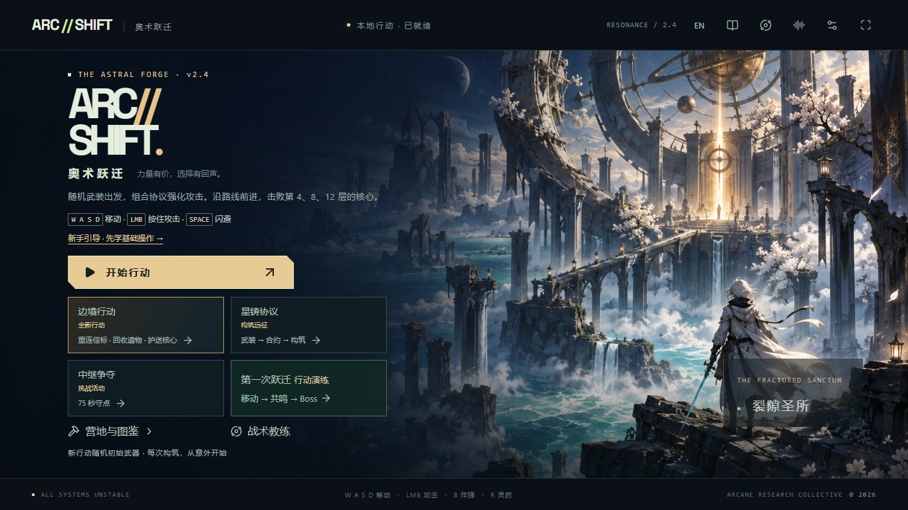

# v2.4.0-rc.1 · 公开试玩候选版

2026-10-07。**[打开游戏](https://arc-shift.black-kid-3047.chatgpt.site/)** · [三分钟上手](PLAY.md)

本次将已有的双语界面、边境路线和音画升级同步到公开源码，重点完善第一次启动、进度保护和异常恢复。

## 玩家可见变化

- 首页直接看到核心按键、教程与指南入口，一键切换中英文。
- 「继续行动」显示武器、生命、时间和检查点位置；开始新局先确认，教程结束也不会直接覆盖旧局。
- 设置中可下载主线/营地存档备份；导入先严格校验、预览，再确认覆盖。损坏、过大、不兼容备份或浏览器写入失败时保留原进度。
- 首次加载、长时间等待和加载失败有明确提示与重试入口；触屏设备会提示需要外设。
- 暂停页说明检查点保存规则；英文短屏菜单布局收紧，所有入口可操作。
- GitHub 首页变为玩家入口，并提供简明游玩说明和问题反馈表。

## 已验证

| 项目 | 结果 |
|---|---|
| 锁文件全新安装与完整依赖审计 | `npm ci` 通过，0 漏洞 |
| TypeScript / lint / 生产构建 | 全部通过 |
| 单元与规则测试 | 279/279 |
| 相关开发浏览器回归 | 16/16，覆盖玩家流程、语言、奖励布局与边境 |
| 完整生产浏览器套件 | 11/11，含实际动态脚本加载失败后的重试与存档保留 |
| 备份独立复查 | 12 个真实检查点往返恢复通过；损坏营地字段被拒绝 |
| 界面检查 | 中文/英文，1366×768 与 1440×900；菜单、指南、设置、错误页 |

[玩家体验实现与测试记录](v24-player-experience.md) · [依赖审计原件](qa/engineering/audit-v24.json) · [依赖修复说明](dependency-security.md)

## 为什么收到失败邮件

[2026-10-05 的运行](https://github.com/QiQiyzhu/arc-shift/actions/runs/37297861270) 由每周 `schedule` 触发，账号是 QiQiyzhu；并不是访客打开游戏。失败发生在依赖审计，旧锁文件中有 16 项漏洞，后续游戏测试被跳过。同一提交前三周成功，本轮保留安全门槛并移除未使用的模板依赖，修复了依赖链。之后仍保留每周检查，新的依赖公告可能再次触发需要维护的通知。

## 当前范围

面向电脑键盘/鼠标、现代 Chromium 浏览器的单人游戏。手机无触屏战斗控制；手柄菜单及实体设备兼容性仍未完整验证。存档保存在本地浏览器，没有账户或云同步。备份仅包含主线/营地和声音/语言设置，不包含独立模式记录及自定义按键。自动化通过不代表真人平衡测试、多设备长期性能验证或商业商店发行认证。

[历史版本与证据](readme-history-before-v24.md)
