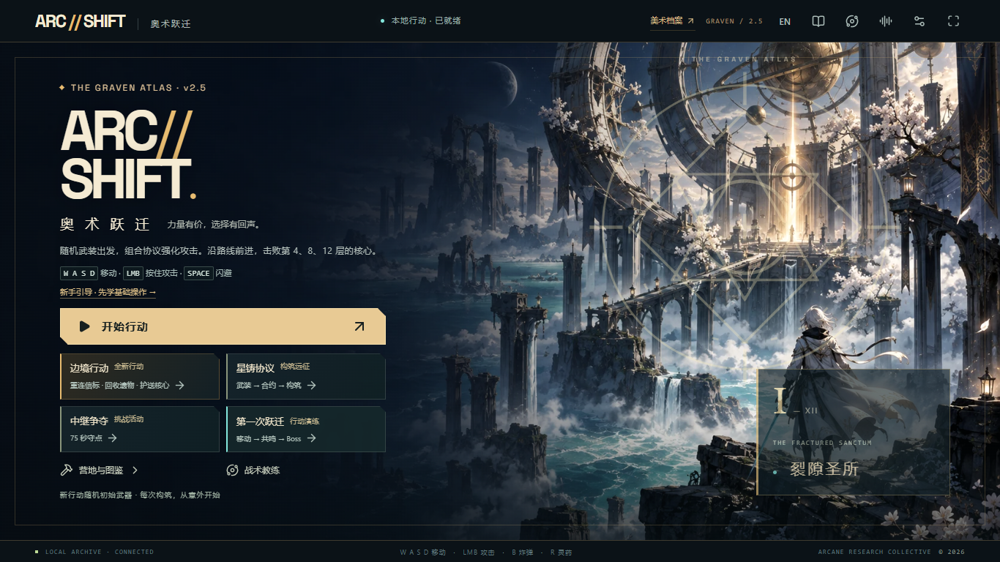

# v2.5.0-rc.1 · 奥术遗迹视觉升级

2026-10-07。**[打开游戏](https://arc-shift.black-kid-3047.chatgpt.site/)** · **[查看双游戏美术策划档案](https://arc-shift.black-kid-3047.chatgpt.site/art-direction/index.html)** · [三分钟上手](PLAY.md)

本版围绕奥术遗迹统一菜单、战斗 HUD 和技能反馈，让玩家更快识别行动目标、技能状态与危险方向。既有路线、攻击判定、规则随机序列和存档格式保持兼容。

## 玩家可见变化

- 铜金铭刻、深色石板与青色能量贯穿首页、暂停、升级、结算和设置；保留原有世界观插画。
- 战斗区减少上下栏占用，生命和任务信息有独立底板；技能槽显示图形冷却环、剩余秒数和就绪状态。
- 己方使用青色符文，强化使用金色，危险使用朱红尖角；颜色之外保留形状和方向线索。
- 闪避、技能、命中与场景阶段使用短时符文、拖尾和受限震动。危险边界绘制在弹幕之上，保留实际攻击范围。
- 「减少动态效果」和「战斗清晰模式」均可独立降低装饰密度，保留危险预警、技能信息和玩家位置。
- 新增可用键盘操作的前后对比、真实游戏录像与技能节奏示意，帮助说明美术设计取舍。

## 验证与证据

| 项目 | 本版结果 |
|---|---|
| TypeScript / lint | 通过 |
| 单元与规则测试 | 284/284，含符文语义、简化模式和随机序列保护 |
| 玩家流程与界面浏览器检查 | 17 项通过：玩家流程 6、语言 5、奖励布局 2、新界面及短窗可达性 4 |
| 战斗与回放浏览器检查 | 3/3 |
| 生产构建与生产浏览器 | 构建通过，11/11；构建产物未发现受检开发工具标记 |
| 实际操作录制 | 58.145 秒，三种武器，零页面错误；使用内置无敌练习场，视频无声 |

[战斗视觉与性能证据](v25-combat-visuals.md) · [双游戏美术策划说明](art-direction-v25.md) · [前版玩家体验与失败邮件原因](release-v2.4.md)

固定场景截图使用同一随机种子和分辨率的开发夹具；节奏动画是独立交互示意。它们在展示页分别标注，不当作自然通关、逐帧性能基准或人类试玩。新增视觉由代码实现，项目方向由用户提出，Codex 协助实现、测试与文档；既有素材来源沿用原许可清单。

## 当前范围

电脑键盘与鼠标、现代 Chromium 浏览器、单人本地存档。手机没有触屏战斗操作，没有多人联机或云同步。单台 Windows 电脑的短时采样不能代表所有设备性能；自动化检查不等于商业商店发行认证或真人平衡研究。本版为公开试玩候选版。
