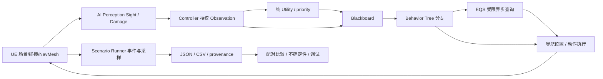

# Aegis Arena · 面试讲解材料 A–T

这份材料用于理解、演示和答辩，不是可以不经理解直接背诵的工作经历。项目由 AI 辅助实现；候选人应亲自复现命令、逐行解释核心代码，并准确陈述独立完成与协作完成的部分。所有数字必须保留对应运行环境，不能把 portable 模型结果包装成 Unreal 结果。

## A. 架构、项目定位与证据边界

**一句话**：Aegis Arena 是一个规模受控的 Unreal C++ 游戏 AI 实验场，把感知、决策、动作执行和评估数据分开，比较 Companion 的优先级策略与 Utility 策略。

**三分钟讲解**：

1. 问题：只展示一个会追击的 Bot 无法说明决策来源、性能预算和效果。我做的是一个有明确观察边界、可以比较策略并导出原始数据的实验场。
2. 架构：Character/Component 执行移动、伤害、冷却；Controller 将 Sight/Damage 感知转换为有限 Observation；Blackboard 和 Behavior Tree 决定分支；Companion 的 Utility 输出评分；EQS 选择可导航的战术位置。
3. 评估：同一组 seed 配对比较策略，记录胜率、玩家承伤、队友死亡和卡住情况。portable 模型有 60 次真实运行，Utility 的队友死亡更少，但胜率和玩家承伤并没有同时更好，因此不声称全面提升。
4. 工程：C++ ownership、查询取消、冷却、Director 限幅、JSON/CSV 原始数据和 CI 都是可检查的。Unreal 资产通过编辑器 API 生成，而不是在引擎外伪造二进制资产。
5. 限制：没有已经训练成功的 RL 策略，不是商业完整游戏，也没有联网、资产美术生产线或线上服务。

**证据状态（随原生验收更新）**：

| 证据 | 实际状态 | 能说明什么 |
| --- | --- | --- |
| portable C++ 严格编译 | 325 个断言通过 | 纯规则与模拟器，不是 325 个独立测试用例 |
| Python integration | 9 个 unittest case 通过 | CLI、验证、真实二进制 JSON/CSV 与报告协议 |
| GitHub Actions | Ubuntu GCC 13.3 / Python 3.11 成功 | 新机器 portable 可复现；不运行 UE |
| UE 5.8.2 Game Development / Shipping | 两个目标真实 build/cook/stage，UAT 153.34s / 128.22s | MSVC 14.50.35738 + SDK 26100 能编译 native gameplay |
| Shipping 静态二进制检查 | 9 个开发入口标记在 Dev 存在、Shipping 缺失 | 静态 gate 与独立 Dev 两轮场景、Shipping 实机启动/入口检查共同记录 |
| UE Editor / 资产 / 原生测试 | 真实编译，10 个原生资产；5 Core Automation + 1 Functional Test（12条PIE世界断言）通过 | 独立于 portable 测试 |
| UE 场景 / 实渲染 | 60 个 native policy episode + 12 个 rendered performance episode 通过；实机 PNG/GIF | NullRHI 策略吞吐不是 FPS，2fps GIF 是抽帧采样 |
| RL / imitation | 未实现、未训练 | 简历不写 RL 成果 |

### 运行时架构与工作节奏



Character movement 可以由引擎逐帧推进，但昂贵观察和评分不需要每帧执行。BT service 为 0.2 秒；根分支之后 Wait 0.2 秒；EQS 每个 Controller 最多一个未完成请求，发起间隔至少 1 秒。场景状态每 0.1 秒采样。性能模式的每帧采样只收集时间，不把 AI 决策改为每帧。

BT 节点是可共享模板。每个 Bot 的 runtime 状态放 Controller/Component/NodeMemory；不能把目标、冷却或上一动作写在共享 BT task UObject 上。

## B. 目录树与职责

```text
AegisArena.uproject
Source/
  AegisArena/                 # runtime C++：Pawn、组件、AI、场景、调试
    Public/AegisCharacter.h
    Public/AegisAIController.h
    Public/AegisLab.h
    Private/Tests/            # Unreal Automation
  AegisArenaEditor/           # 仅 Editor：资产生成、Functional Test
core/
  include/aegis/rules.hpp     # 可移植纯规则
  include/aegis/geometry.hpp  # 模型几何，明确不是 Recast/EQS
  include/aegis/simulation.hpp
  src/main.cpp
  tests/tests.cpp
scripts/                     # 编译、验证、评估、真实 trace 渲染
  unreal/create_arena.py     # 在 UE 内创建资产与地图
scenarios/                   # portable 场景定义
Content/Aegis/               # 由 UE 生成并保存的原生资产
Config/                      # 输入、默认地图、导航、渲染
.github/workflows/portable.yml
 evidence/portable/          # 原始结果、摘要、provenance
 evidence/unreal/            # 仅真实原生运行证据
 docs/                       # 架构、算法、局限和本材料
```

C++ 负责行为和数据协议。编辑器工具负责资产连接、primitive 场景与参数。没有必要把纯评分公式放进 Blueprint，也没有必要为一个颜色参数新建 C++ 子类。

## C. Schema、结构与单位

| 数据 | 所属层 | 关键字段 / 不变量 |
| --- | --- | --- |
| Health | core / native component | maximum ≥ 1；current 在合法范围；死亡不能普通 Heal 复活 |
| Observation | pure decision boundary | 可见/记忆目标、自己血量、被观察盟友血量与距离、支援冷却 |
| Utility scores | decision | Follow / Attack / Support / Retreat，有限数，选择具有 hysteresis |
| Blackboard | UE | TargetActor、LastKnownLocation、HasLOS、HasMemory、CriticalHealth、NeedsRecovery、NeedsCover、InRange、IsCompanion、UtilityAction、TacticalPoint、QueryPending |
| Scenario | UE / Python 明确分离的协议 | arena、playerConfig、companionPolicy、enemyPolicy、enemyCount、seed、duration |
| Episode result | UE | engine=unreal-runtime，实际伤害事件与采样统计、策略和 seed |
| portable episode | simulator | 自己的 engine 标记与固定步长模型；不能与 UE 数字直接混合 |

Unreal 距离单位是厘米，pure Utility 观察距离换算为米。时间为秒；性能报告明确毫秒/微秒。`time-to-engage` 在 UE 表示第一次实际伤害，在 portable 表示第一次攻击尝试：对照时先统一指标，不能直接横比。

示意场景配置（不是生成结果）：

```json
{
  "arena": "AegisArena",
  "playerConfig": "scripted",
  "companionPolicy": "utility",
  "enemyPolicy": "behavior_tree",
  "enemyCount": 4,
  "seed": 1001,
  "duration": 60,
  "directorEnabled": false,
  "performanceMode": false
}
```

性能模式关闭伤害来维持固定 Bot 负载，必须单独标注，不能计入胜率。Director 开启时敌人总数会变化，记录累计生成数；与固定数量基线比较时必须控制这个变量。

## D. RAG · N/A

**N/A**。本项目不需要检索文档生成文本，不维护向量索引，不做 chunking、embedding 或 citation reranking。真实能力边界是实时游戏 AI。把空间 EQS 查询称作 RAG 会混淆概念：EQS 返回空间候选点与分数，RAG 为语言模型提供检索证据。

可以讨论未来“检索设计文档的开发工具”，但那是另一个工具，不是当前 Bot 决策回路；不能写进已交付能力。

## E. 游戏 Agent

一个 Bot 具有 sensor → observation → policy → action → environment 的闭环。它有部分可观察性、动作约束、冷却和生命周期。它不会调用大模型或联网工具，也没有无限自主规划。

**Behavior Tree**：适合层级优先级与中断逻辑；图可视化方便，节点复用好；过多全局 Blackboard key 和复杂 abort 依赖会降低可维护性。

**Utility AI**：适合 Companion 在攻击、支援、撤退、跟随之间连续权衡；必须记录分数与选择理由，否则只是不可解释的调参。0.08 切换优势是抑制抖动的设计参数，不是被实验证明的最优值。

**StateTree**：适合明确的状态转换与任务生命周期；本项目已使用 BT 协调执行，重复引入 StateTree 会增加维护面，因此没有为了关键词叠加它。

## F. MCP · 运行时 N/A

**运行时 N/A**。MCP 不参与射击、导航、感知或评分。开发时 agent 可以借助文件、编译器、GitHub 工具，但游戏不是一个 MCP server。面试时区分“用工具开发了项目”和“项目本身实现了该协议”。

若未来接入编辑器工具服务，应限定项目路径、允许的场景操作、最大测试时长与输出目录，拒绝任意 shell；该设计不等于当前已实现。

## G. LLMOps · N/A 与实际实验工程

**LLMOps N/A**：没有模型 API、prompt 版本、token 成本或在线模型监控。实际有的是游戏 AI 实验工程：场景 schema、随机 seed、策略版本、编译器信息、原始 episode、报告生成和 CI。

portable report 记录 source / executable 摘要以说明“哪个二进制产生了哪个结果”；raw JSON/CSV 与聚合报告一起保留。更换规则后要重新运行评估，不能沿用旧结果并改标题。

AI-assisted development log 记录 AI 帮助的范围、真实执行过的命令和未通过的原生验收。可解释、可复现和不夸大比堆砌 agent 术语更重要。

## H. Reliability · 生命周期与恢复

- `UPROPERTY TObjectPtr` 管理 UObject 强引用；被观察目标使用 `TWeakObjectPtr`，使用前验证。
- Pawn 销毁与 Controller 销毁是两个对象生命周期。Scenario 清理明确处理二者，防止跨 episode 留下 Controller。
- 计时器在 EndPlay 清除；退出/换图取消 EQS 与 Brain logic。
- 一个 Controller 同时最多一项 EQS；callback 校验 query ID，过期结果不会移动新 Pawn。
- 查询失败更新 QueryPending，不能永久显示“等待”。
- 生成地图/资产遇到既有内容时明确拒绝覆盖。批跑目录包含 GUID，避免同秒互相覆盖。
- BT action 在冷却期间仍保持攻击分支；不能把“尚未准备好开火”当作应转入 Patrol。
- 运行 preflight 检查资产、地图和 NavMesh。自动启动等待导航有 30 秒上限，失败有非零退出码。

恢复策略不是任意重试：配置错误直接失败；无 NavMesh 是结构问题；EQS 没有可行点会返回 BT failure，让既有 selector 执行授权 LastKnown 的 Investigate 等回退；pending 查询、有效移动和接受半径内的已到达点仍保持成功，查询受限频约束。对某种失败无限重试会掩盖坏场景。

## I. Security · 边界与构建配置

本项目没有账户、在线数据库或认证。安全面主要是工具执行、输入配置和调试入口。

1. Shipping 通过编译条件移除开发 console registrations 和 debug overlay；验收应检查打包二进制与实际入口，而不是只搜索源码。
2. scenario 限制敌人 1–50、时长 1–300 秒、episode 1–100，拒绝非有限数与 seed 递增溢出。
3. 不上传引擎、工具链、缓存、密钥、`.env`、系统安装日志或用户目录隐私数据。
4. installer 使用 Microsoft 官方域、SHA256 和 Authenticode；管理员动作失败不能换个命令绕过审批。
5. 分享的是源码、许可明确的 primitive 资产和真实证据；不把下载的商用/未知许可证素材塞进仓库。

## J. Test · 分层验证

```bash
python scripts/verify_portable.py
python scripts/verify_portable.py --full
```

这两条命令不要求 UE：编译 C++17、运行 325 个断言、9 个 Python case，再运行短场景；`--full` 增加既定完整评估。没有编译器时应明确失败，不输出假成功。

```powershell
./scripts/build_unreal.ps1 -EngineRoot $env:UE_ENGINE_ROOT -CacheRoot $env:AEGIS_CACHE_ROOT -Automation
```

该命令必须实际生成 Automation report，检查完成数和失败数；进程 exit 0 不代表测试已执行。原生 Automation 覆盖伤害/队伍、授权评分、Director 界限、序列化、seed。Functional Test 用真实 World 中两个角色验证 trace 命中、冷却、友伤、死亡与治疗，不用截图替代断言。

**高价值回归**：同队攻击不扣血；零/负/NaN 伤害拒绝；死者不可普通治疗；支援未知盟友分数为零；EQS 退出 callback 不触碰无效 Pawn；episode 清理后 Actor/Controller 计数回到基线；导航缺失不能生成成功报告；Shipping console entry 不存在。

## K. RAG benchmark · N/A；实际游戏 AI 评估

**RAG benchmark 不适用**：没有检索或生成式问答，因而不存在 Recall@k、MRR、faithfulness 结果。实际游戏 AI 评估见 [evaluation.md](https://github.com/QiQiyzhu/aegis-arena/blob/codex/aegis-v1/docs/evaluation.md) 与原生 [验收清单](https://github.com/QiQiyzhu/aegis-arena/blob/codex/aegis-v1/docs/status.md)。下面保留可核查的策略数据，不能改名为 RAG 指标。

portable 实验使用 seeds 1001–1030，每个 seed 比较 priority 与 utility，共 60 个 episode。

| portable 指标 | priority | utility |
| --- | ---: | ---: |
| 胜利次数 / 30 | 20 | 19 |
| Wilson 95% 胜率区间 | 48.8%–80.8% | 45.5%–78.1% |
| 队友死亡次数 / 30 | 16 | 6 |
| 玩家平均承伤 | 86.53 | 104.50 |
| 盟友总输出均值（玩家+队友） | 359.96 | 344.22 |
| 平均持续时间（秒） | 33.91 | 35.47 |
| 平均 stuck events | 4.17 | 5.17 |

**能说**：在这套 portable 场景中，Utility 更倾向保全队友；存在任务与生存的 trade-off。

**不能说**：胜率显著提升、模型比 UE 更快、所有场景优于 BT、收益具有商业泛化能力。小样本区间重叠；更完整的配对统计、效应大小和独立 holdout 是后续工作。报告路径 `evidence/portable/evaluation/`。

原生结果使用 `engine=unreal-runtime` 的独立目录。最终 60 次 UE episode（相同 30 seeds，每策略各一次）：两组均 0/30 胜利，priority / utility 队友死亡为 25 / 6，玩家承伤均值 106.68 / 126.06，盟友输出均值 170.46 / 139.40。压力场景有胜率下界效应，不能据此说 Utility 全面更强。使用 1/60 固定游戏步长和 NullRHI，严格不等同渲染性能。见 [原生评估](https://github.com/QiQiyzhu/aegis-arena/blob/codex/aegis-v1/docs/native-evaluation.md) 与对应 raw JSON/CSV。

## L. Ablation · 策略对照与未执行消融

已做的是 **priority vs utility 策略对照**，它不是完整多因素消融。两组共享模型、种子、敌人、地图；主要变化是 Companion policy。

下一步高价值消融方案（尚不能写成实验结果）：

| 单一变量 | 对照 | 检验假设 |
| --- | --- | --- |
| Utility hysteresis | 0 vs 0.08 | 减少每秒动作切换，但可能延迟必要反应 |
| 记忆窗口 | 0 vs 2.5 秒 | 丢失 LOS 后调查更稳定，但追踪过时位置增加 |
| EQS 限频 | 0.2 vs 1 秒 | 降低 CPU，检查战术反应变差程度 |
| Director | off vs on | 检查恢复窗口与压力曲线，而非仅比较胜率 |
| BT service | 0.1 vs 0.2 秒 | 反应速度/CPU 的受控交换 |

先预设主要指标，再选择独立 seed；调参用训练/开发 seeds，最终评估用未参与调参的一组，不能拿表现最好的 seed 做唯一宣传。

## M. Performance · 测量方法与边界

portable 性能报告是固定步长 C++ 模型 CPU 时间，20 次 episode，初始敌人 1/10/25/50，每档 5 个 seeds。高负载可能提前死亡，故不是持续 UE 大量 Bot 压测。真实报告在 `evidence/portable/performance/`，不要把微秒结果标成 Unreal Game Thread。

Unreal 已实际采样：RTX 4060 Laptop / D3D12 / UE 5.8.2 Editor Game，1280×720 offscreen，四档各 3×15 秒，另有两个盟友，首秒排除。四档平均 episode frame P95 为 4.042 / 4.171 / 4.261 / 4.325ms；这不是 pooled P95、Shipping FPS 或优化提升，最终四档 EQS 完成数为 2 / 14 / 44 / 45，失败数 0 / 0 / 0 / 0，但查询数量有限，不代表最坏战术负载。见 [原始报告与边界](https://github.com/QiQiyzhu/aegis-arena/blob/codex/aegis-v1/docs/performance.md)。

采样定义：

- Native `ObserveAndUtility` 范围测量决策 CPU；不是整个 AI 系统耗时。
- `FEnvQueryInstance::TotalExecutionTime` 记录引擎累计执行时间；不能用提交到 callback 的等待延迟冒充 CPU。
- frame wall time 与 Game Thread busy time 分开；渲染开启状态写入结果。
- 进程驻留内存不是项目独占内存，也不等于 UObject 内存。
- 性能模式关闭伤害维持负载，首秒作为 warm-up，不计入帧统计。
- 1/10/25/50 指敌人数，另有 2 个脚本角色；展示总 Actor/AI 数量时应明确加上它们。

优化顺序：采集热点 → 限定瓶颈 → 改一个变量 → 相同场景复测 → 检查行为退化。当前已使用 service interval、one outstanding EQS、查询间隔和有限采样；没有宣称尚未实测的百分比提升。

## N. Failures · 真实失败与修复

1. **环境缺 SDK**：初次 Win64 UBT 在 C++ 编译前失败。安装 Windows SDK 后进入真正编译；因此曾经的“环境不可编译”不是“代码已正确”。
2. **原有 VC++ x86 缓存损坏**：升级遇到 MSI 1612/1714，旧版本 14.44.35211 安装源缺失。准备微软官方旧包验证哈希/签名后修复，不手删注册表。
3. **5.8 编译适配**：成员遮蔽 warning-as-error、缺失显式 PathFollowing 头、TObjectPtr 不能用 auto* 自动推导、Automation mask 变为独立常量。保留严格编译而非关警告。
4. **查询状态错误**：失败 callback 同样需要结束 QueryPending；否则调试 UI 看起来永远在等。
5. **动作吞吐错误**：攻击冷却未结束不能触发 fallback 巡逻；恢复动作由 200ms 节奏控制，避免变成逐帧回血。
6. **Director cap**：即使尚在调难度 cooldown 内，也必须按当前敌人数量施加硬上限。portable 回归已覆盖。
7. **评估反直觉**：队友更少死亡没有带来更高胜率；原生两策略都 0/30，保留胜率下界和输出/承伤代价。
8. **原生资产陷阱**：部分 BT 图自动更新会丢节点；EQS 新对象需更新 node version，否则旧版本迁移反转评分。均通过保存后重新加载检查发现。
9. **保存后的导航冷启动**：空 Recast 已保存数据不会自动当作新生成对象重建；改为取得 NavData 后一次异步 rebuild，wall-clock 超时，不能同步阻塞主线程。
10. **真实截图黑镜头**：Python Rotator 用命名参数；更关键是不能用第一个 CameraActor，引擎有辅助动画相机。用 runtime tag 选择并核验实际 PlayerViewPoint，重新目视原生 PNG。

11. **EQS 查询中心停留出生点**：Controller 默认不跟随 Pawn，查询网格因此过时；真实坐标和 FailedTestIndex 确认后开启 bAttachToPawn，并增加原生移动 Querier 回归。失败率从约 57%–60% 降至约 0.9%–1.8%，但不据此声称策略全面更优。
12. **测试 JSON 假阳性**：UE 报 Success 但实际没有运行 test actor。显式预载地图、要求 PIE world，并校验十二条断言和成功标记；两项 Python gate 回归拒绝这种报告。

## O. Unfinished · 未完成项

按面试展示严重度排序：

| 优先级 | 问题 | 验收标准 |
| --- | --- | --- |
| 已完成 | UE Editor / 原生基础验收 | Editor build、资产生成、5 Automation、1 Functional Test 与 60 场景报告均真实完成 |
| 已完成 | 原生独立打包与启动 | Dev 无 Editor 跑两轮；Shipping 真正显示地图/AI，HUD与console关闭；下载见 release.md |
| P1 | 性能外推与长时间追踪 | 四档短时实渲染已完成；仍需长 warm-up、独立复测与 Insights，不宣称商业性能 |
| 已完成 / P2 | BT/EQS runtime 视觉证据 | 真实最近 BT 动作、Query ID、候选分数已截图；Editor debugger graph 录像仍未做 |
| P1 | 多样场景泛化 | 更多几何布局和独立 holdout；当前一张 Arena 不能证明泛化 |
| P2 | 控制与表现 | primitive 演示，不是完整动作商业游戏；输入与瞄准还需玩家测试 |
| P2 | RL 可行性 | 若未来引擎实验插件真实可跑，再独立训练和评估；当前没有结果 |

面试问到未完成内容时，回答缺口、原因、验收方法和下一步，不回答“理论上已经支持”。

## P. 10 个必须逐行理解的 native / core 文件

| 文件 | 必须能解释的内容 |
| --- | --- |
| `core/include/aegis/rules.hpp` | 有限输入、伤害队伍过滤、评分、hysteresis、Director EMA/cooldown/cap |
| `core/include/aegis/geometry.hpp` | 线段/圆障碍、模型几何局限；为什么不是 NavMesh |
| `core/include/aegis/simulation.hpp` | 固定步长、观测、动作、seed、事件计数与终止条件 |
| `core/src/main.cpp` | CLI 验证、返回码、输出协议 |
| `Source/AegisArena/Private/AegisCharacter.cpp` | Actor/Component 生命周期，碰撞 trace，伤害与冷却 |
| `Source/AegisArena/Private/AegisAIController.cpp` | 感知授权，Blackboard，shared node，EQS 完成/取消与观察边界 |
| `Source/AegisArena/Private/AegisLab.cpp` | deferred spawn、episode ownership、报告、Director 应用和性能采样 |
| `Source/AegisArena/Private/AegisDebugCommands.cpp` | Shipping gates、命令参数、pause/step 的含义 |
| `Source/AegisArenaEditor/Private/AegisEditorLibrary.cpp` | 真正资产创建/保存、BT 图、EQS 配置、NavMesh brush |
| `core/tests/tests.cpp` | 为什么覆盖边界，325 是断言数，哪些不覆盖 UE runtime |

## Q. 5 个游戏 / 工具呈现入口

这里没有 Web frontend。“5 个前端/呈现入口”对应真正的游戏与开发工具：

1. `AAegisDebugHUD::DrawHUD`：状态、目标、评分、血量/冷却和 Director 解释。
2. `aegis.Visualize`：感知/战术点快照；选中点不代表全部候选的完整 EQS debugger。
3. `scripts/unreal/create_arena.py`：场景几何、材料、灯光、观察摄像机与资产连接。
4. `AAegisScenarioRunner` 的 Details panel：policy、数量、seed、episode 与 Run；地图选择必须真切换地图再运行。
5. `scripts/render_trace.py` + `docs/media/portable-trace.gif`：只由真实 portable trace 生成并永久标注非 UE footage。

## R. 10 个手写代码练习

练习时先写契约与边界，再写代码。答案应能被运行验证，不能只复述语法。

1. **有界伤害**：实现 `applyDamage(current, maximum, amount, hostile)`，返回实际扣血；拒绝 NaN、负数、友伤；过量伤害只记实际扣除。测试 100HP 受到 150 伤害仅累计 100。
2. **冷却**：实现基于单调时间的 `readyAt`，不能用 `counter--` 跟帧率耦合。测试同一时刻连发只接受一次，暂停策略清晰。
3. **Utility hysteresis**：数组取最大值；新动作超过旧动作 0.08 才切换；旧动作已经非法时不能被 hysteresis 保留。测试相同分数有稳定顺序。
4. **EMA Director**：写 `alpha=1-exp(-dt/tau)`，再 clamp 与两阈值 hysteresis。说明为什么将硬 enemy cap 放在 cooldown 早退之后会出错。
5. **seed 递增防溢出**：先检查 `seed <= INT_MAX - (episodes-1)`，再生成 seed；不要先溢出再检查。讨论 unsigned wrap 与 signed UB。
6. **weak target**：用 `TWeakObjectPtr<AAegisCharacter>` 保存观测目标；使用前检查 valid/alive。解释 `UPROPERTY` 不会让已经 Destroy 的 Actor 重新有效。
7. **异步 query 生命周期**：最多一个请求；保存 ID；callback 校验 ID；EndPlay 取消；取消后不触发移动。画出完成、失败、死亡三条路径。
8. **episode RAII/cleanup**：清 timer、query、Pawn、Controller，再清 arrays；多次调用应安全。测试连续 100 episode 后 actor/controller 数不增长。
9. **JSON 边界**：读取固定 schema，拒绝 unknown key、非有限 duration、越界 enemy count；不可静默修复以免实验不可复现。
10. **统计聚合**：计算均值、最近秩 P95 和 Wilson interval；明确样本是 frame、episode 还是 seed；不得把 30 个 seed 的数千帧当独立政策样本。

可以手写的最小 C++ 示例（策略切换，不是全部生产校验）：

```cpp
#include <array>
#include <cmath>
#include <cstddef>

std::size_t chooseAction(const std::array<double, 4>& score,
                         std::size_t previous, double margin) {
    std::size_t best = 0;
    for (std::size_t i = 1; i < score.size(); ++i)
        if (score[i] > score[best]) best = i;
    if (previous < score.size() && std::isfinite(score[previous]) &&
        score[previous] > 0.0 && score[best] <= score[previous] + margin)
        return previous;
    return best;
}
```

追问时指出：示例假设 score 已在输入边界标准化为有限数、margin 非负有限；如果允许原始 NaN，必须先验证。`best=0` 是稳定 tie-break，意味着动作顺序是策略的一部分。

## S. 20 个追问

1. **为什么用 BT 而不是大 if/else？** 分支与执行责任可视化，复用 task/service，调试当前路径；不意味着没有任何条件语句。
2. **Blackboard 是全局数据库吗？** 每个 AI 的决策上下文；键和值只服务可解释的行为协作，不能存任意游戏真值。
3. **Sight 与直接 GetPlayerPawn 有什么区别？** Sight 受遮挡、范围、角度和记忆影响；全局查询会绕过部分可观察性。
4. **Damage 感知能直接锁定目标吗？** 可以记录被报告的历史来源位置，不能凭伤害事件获得持续视觉跟踪。
5. **为什么 ally health 可以读取？** 只有当前可观察且已授权的盟友进入 DTO；未知盟友不产生支援分数。
6. **EQS 与导航有什么区别？** EQS 选择有评分的目标位置；NavMesh/PathFollowing 找路径与执行移动。
7. **EQS 没有结果怎么办？** 完成 pending 状态、记录失败、不使用无效点；把没有可用动作的 BT 分支标记失败，让 selector 回退；pending、有效移动或已到达接受范围不应误判失败。不能瞬移到假位置。
8. **Utility 高分为什么没执行？** 检查授权条件、BT 分支、动作合法性和冷却；评分与执行是不同层。
9. **为何使用 hysteresis？** 避免相近分数不断切换；阈值过大会变迟钝，需要消融验证。
10. **Director 会读取真值吗？** Director 是有明确授权的 encounter 系统，可用全局负载/玩家状态；Companion 的授权不同，不能混为一谈。
11. **如何避免难度振荡？** EMA 平滑、上下阈值分离、调整 cooldown、输出 clamp、恢复窗口；硬敌人数上限始终成立。
12. **Tick 真的全部禁用了吗？** 没有。引擎移动和必要呈现仍逐帧；昂贵决策限频，性能采样仅测试时启用。
13. **Pawn、Controller、Actor、Component 区别？** Actor 是世界对象；Pawn 可被控制；Controller 决策/控制；Component 组合具体能力；销毁边界要分别处理。
14. **UPROPERTY 等于 RAII 吗？** 不等同。它让 GC 识别引用与反射；TSharedPtr 用于非 UObject 资源；Timer、delegate、query 的解除仍要显式生命周期设计。
15. **如何证明不泄漏？** 清理后的 Actor/Controller 数、重复场景、进程内存曲线、工具追踪；单次内存未增长不是证明。
16. **为什么 seed 一样 UE 仍可能有差别？** 调度、浮点、帧率、异步导航/感知和执行环境；记录环境与时序，区分可控随机性和严格确定性。
17. **Utility 队友活得更久为什么玩家更容易受伤？** 撤退/支援可能减少吸引火力或输出；这是任务回报与个体生存的目标冲突。
18. **RL reward 怎么设计？** 先建立 scripted baseline，再设生存、承伤、有效距离等小目标；识别原地躲角落等 reward hacking；目前仅设计，不宣称训练过。
19. **训练 reward 高为什么不能直接写简历？** 奖励可能被投机利用、训练 seed 过拟合；独立 evaluation 的胜率/承伤/卡住等才反映行为。
20. **你如何解释 AI 代写？** 展示开发日志、真实失败与修复、可复现命令，现场修改核心代码并解释测试；不虚构个人任职或团队生产经验。

## T. 5 条真实简历 bullet

下述表述只适用于候选人已亲自复现并能解释代码之后；不要把“AI 辅助完成”改成虚构商业经历。

- 构建 C++17 可移植游戏 AI 规则与评估模型，并通过 GCC/Clang 严格编译、325 个断言及 9 个 Python integration case，GitHub Actions 提供可复现运行证据。
- 实现基于授权观察的 Companion Utility 策略与优先级基线，在 30 个配对 seeds、60 次 portable episode 上记录胜率、承伤和队友死亡，保留原始 JSON/CSV 与置信区间。
- 实现 EMA、hysteresis、cooldown 与 clamp 组成的有界 Encounter Director，并为调整冷却期间仍需施加敌人数上限的边界增加回归验证。
- 使用 Unreal 5.8.2 C++ 实现 Perception、Blackboard/Behavior Tree、EQS 与场景评测；真实生成 10 个原生资产，通过 5 项 Core Automation 和 1 项 World Functional Test，其中 Functional 执行12条PIE世界断言，并保留60局原生策略实验的JSON/CSV。
- 建立清晰区分 portable 与 Unreal 的实验交付流程，保存源码/二进制 provenance、原始 episode、失败日志、工具链条件与已知限制，避免以模拟器结果替代引擎证据。

不要添加不存在的用户量、性能提升百分比、线上可用性、商业 RL 或“独立从零手写全部代码”。简历中的原生结果对应仓库原始报告；Dev/Shipping独立包已实际运行；长时间性能与完整交互覆盖仍以状态清单明确边界。
